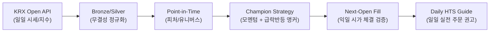
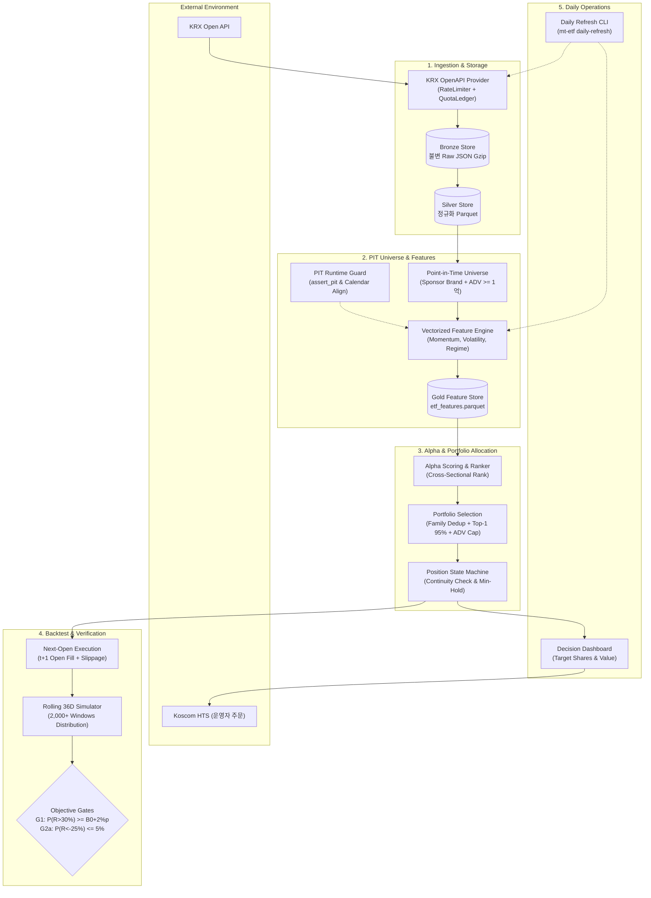
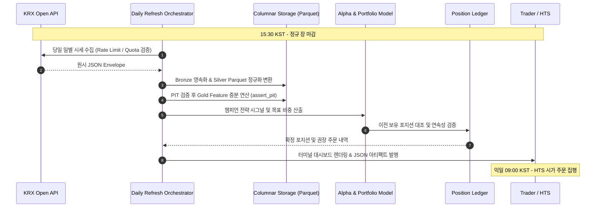

# mt-etf-king-2026: Tournament Quant Research & Execution System

> **머니투데이 제3회 ETF 투자왕 대회(2026) 우승을 목표로 설계된 토너먼트 특화 퀀트 리서치 및 일일 운용 파이프라인**

[](tests/)
[-blue)](pyproject.toml)
[](src/)
[](docs/architecture/data-flow.md)
[](docs/knowledge/mt-data-report.md)

---

## 1. Executive Summary

본 프로젝트는 머니투데이 제3회 ETF 투자왕 대회(2026-09-21 ~ 2026-11-13, 36 거래세션, 초기 자본 10억 원)에서 **최상위 순위(1~2위) 진입 확률을 극대화**하기 위해 개발된 토너먼트 전용 퀀트 시스템입니다.

일반적인 자산 운용(Sharpe 극대화, 저변동성 분산)과 달리, 단기 대회의 계단형 상금 구조에 맞추어 **36거래일 우측 꼬리 수익률($P(R_{36d} > 30\%)$) 극대화**를 핵심 목적함수로 정의했습니다. 한국거래소(KRX) Open API 데이터 수집부터 Point-in-Time 유니버스 선별, 벡터화 피처 연산, 국면 적응형 모멘텀 전략, 그리고 익일 시가 체결(Next-Open Fill) 시뮬레이션까지 전 과정을 단일 파이프라인으로 구현했습니다.



---

## 2. Problem & Core Engineering Solutions

| 핵심 난제 (Challenge) | 일반적인 접근법의 한계 | 본 시스템의 엔지니어링 솔루션 |
| :--- | :--- | :--- |
| **비대칭 상금 구조** | 샤프 지수 최적화는 연율 5~10% 수준의 온건한 수익에 머물러 대회 우승 기대값 0원 수렴 | **우측 꼬리 확률 $P(R_{36d} > 30\%)$ 극대화** + 회복 불가능한 손실 차단을 위한 **파산 제약(G2a: $P(R < -25\%) \le 5\%$) 하드 게이트** 적용 |
| **미래 참조 편향<br>(Look-Ahead Bias)** | 당일 종가 시그널을 당일 종가에 즉시 체결(Same-bar Fill)하는 비현실적 가정 사용 | **Next-Open 체결 엔진**: $t$일 장 마감 후 시그널 산출 $\to$ $t+1$일 09:00 시가 체결, 오버나이트 갭 및 슬리피지(3~10 bps) 반영 |
| **금융 시계열 결측 &<br>KRX API 특이점** | 휴장일 더미 레코드(1,163행)나 공백(`""`)을 0으로 채워 시계열 및 팩터 왜곡 유발 | **엄격한 스키마 디코딩(`""` $\to$ `None`)**, XKRX 개장일 세션 정렬, **런타임 `assert_pit` 가드**를 통한 Fail-closed 방어 |
| **제한된 독립 표본 수<br>($n_{\text{eff}} \approx 2,400$)** | 딥러닝/복합 신경망 사용 시 시계열 중첩과 단면 상관성으로 인한 극심한 과적합 발생 | **엄격한 용량 제약형 GBDT Ranker**(`max_depth=4`, `num_leaves=8`) 및 룰 기반 챔피언 전략 채택, Purged Walk-Forward CV 검증 |

---

## 3. Key Architectural Highlights

* 🛡️ **Point-in-Time 시계열 무결성 가드**
  * 피처 연산 및 유니버스 필터 진입 시 `assert_pit(df, decision_date)`를 실행하여 미래 데이터 유입 시 즉시 예외를 발생(Fail-closed)시킵니다.
  * 거래소 캘린더(XKRX)와 실제 거래 세션을 정렬하여 임시 휴장 세션의 NaN 전파를 원천 차단합니다.

* ⚡ **초고속 In-Memory 벡터화 파이프라인**
  * RDBMS 데몬 의존성 없이 불변 Bronze(`.json.gz`) $\to$ 정규화 Silver Parquet $\to$ 고성능 Gold Parquet 구조를 채택했습니다.
  * Polars 컬럼너 지연 평가(LazyFrame)를 활용하여 8개년 수백만 행의 단면 랭킹과 2,000+개 롤링 백테스트를 수 초 이내에 완주합니다.

* 🎯 **토너먼트 국면 적응형 챔피언 전략 (`sticky.mom60_post_crash_anchor`)**
  * 평시에는 60일 모멘텀 최선호 종목을 유지하되, 지수 급락 후 반등 국면(CRASH_REBOUND) 진입 시 대표 지수 레버리지를 20일 모멘텀으로 앵커링하고 15% 손절 가드로 방어합니다.
  * 모멘텀 전략이 급락 직후 현금 100%로 철수하여 반등을 놓치는 구조적 결함을 해결, $P(R > 30\%)$를 6.78%에서 **7.77%**로 개선했습니다.

* ⚖️ **동일 기초지수 레버리지 패밀리 중복 배제 (Family Deduplication)**
  * 동일 기초지수를 추종하는 다중 배수 종목군(1X, 2X, -1X, -2X)을 단일 그룹으로 묶어 상위 1개만 통과시킵니다.
  * 동일 팩터에 대한 중복 베팅을 원천 차단하며, 일일 거래대금(ADV) 5% 캡 및 Top-1 집중(최대 95%) 배분을 수행합니다.

* 🔄 **장 마감 후 원스톱 자동 배치 (`daily-refresh`)**
  * 매일 16:00 KST에 단일 CLI 명령 또는 systemd 타이머로 데이터 수집 $\to$ 정규화 $\to$ 피처 생성 $\to$ 익일 HTS 주문 가이드 산출까지 일괄 완료합니다.

---

## 4. System Architecture

시스템은 **Data $\to$ Feature $\to$ Alpha $\to$ Portfolio $\to$ Execution**의 관심사를 엄격히 분리하여 설계되었습니다.



---

## 5. End-to-End Daily Pipeline

장 마감 후 매일 16:00 KST에 수행되는 일일 운용 파이프라인의 입출력 흐름입니다.



| 파이프라인 단계 | 실행 시점 | 주요 처리 내용 | 입출력 데이터 |
| :--- | :---: | :--- | :--- |
| **1. Data Ingestion** | 16:00 KST | 토큰 버킷 속도 제어로 당일 시세 수집, 쿼터 장부 갱신 | KRX API $\to$ `data/raw/.../*.json.gz` |
| **2. Normalization** | 16:01 KST | 휴장일 응답 제거, 공백 디코딩(`""` $\to$ `None`), 타입 정규화 | Bronze $\to$ `etf_daily.parquet` |
| **3. PIT Universe & Features** | 16:02 KST | 생존 종목 판정, 후원사 및 유동성 필터, 모멘텀/레짐 벡터 연산 | Silver $\to$ `etf_features.parquet` |
| **4. Alpha & Portfolio** | 16:03 KST | 챔피언 룰 스코어링, 레버리지 패밀리 중복 제거, 비중 산출 | Features $\to$ Target Weights |
| **5. State Continuity Guard** | 16:03 KST | 전일 포지션 승계 확인, 불필요한 매매 회전율 방지, Fail-closed | State Ledger $\to$ Validated Position |
| **6. Decision Output** | 16:04 KST | 결정일 종가 기준 권장 매매 수량(주) 및 금액 HTS 가이드 발행 | `results/decide_daily/*.json` |

---

## 6. Empirical Results

2018-01-02부터 2026-09-10까지 총 **2,097개 롤링 36거래일 윈도우**에서 실측된 공식 백테스트 결과입니다.

| 전략 모델 (Model Key) | 평가 윈도우 | $P(R_{36d} > 30\%)$ | $P(R_{36d} > 40\%)$ | $P(R_{36d} > 50\%)$ | 상위 5% 분위수 ($q_{95}$) | Worst 5% 꼬리손실 (CVaR) | Objective Gate |
| :--- | :---: | :---: | :---: | :---: | :---: | :---: | :---: |
| **`baseline.buy_hold` (B0)** | 2,088 | 2.54% | 1.25% | 0.48% | +21.01% | -15.09% | **FAIL** |
| **`baseline.mom20_top1` (B1)** | 2,088 | 3.83% | 2.97% | 2.39% | +21.88% | -24.78% | **FAIL** |
| **`sticky.mom60_raw` (P27)** | 2,095 | 6.78% | 5.92% | 4.96% | +49.51% | -23.16% | **PASS** |
| **`sticky.mom60_post_crash_anchor` (Champion)** | **2,097** | **7.77%** | **5.87%** | **4.43%** | **+43.85%** | **-21.56%** | **PASS** |

> [!NOTE]
> **핵심 성과 지표 요약**
> * **우승권 도달률 3배 향상**: 챔피언 전략은 벤치마크(B0) 대비 30% 초과 수익 달성 확률이 **+5.23%p (2.54% $\to$ 7.77%)**로 3배 이상 높습니다.
> * **파산 위험 완벽 통제**: 극단적 꼬리 위험 CVaR(5%)이 **-21.56%**로 파산 방어 게이트($\le -25\%$)를 안정적으로 충족합니다.
> * **연도별 강건성 (LOYO)**: 특정 강세장에 의존하지 않고 전 연도 Out-of-Sample 구간에서 일관된 초과 성과를 기록했습니다.

---

## 7. Key Architecture Decisions (ADR Summary)

| ADR | 주제 | 채택된 솔루션 | 기각된 대안 | 엔지니어링 근거 및 트레이드오프 |
| :--- | :--- | :--- | :--- | :--- |
| **ADR-01** | **토너먼트 목적함수** | **36D 롤링 우측 꼬리 확률 최적화** + 파산 제약 게이트 | 샤프 지수 극대화, 단일 대회 리플레이 | 1~2위에 집중된 계단형 상금 구조 부합. 일별 변동성은 증가하나 우승 기대값 극대화 |
| **ADR-02** | **체결 모델링** | **Next-Open Fill** ($t$일 종가 시그널 $\to$ $t+1$일 시가 체결) | 당일 종가 동시체결 (Same-bar Fill) | 미래 참조 편향(Look-Ahead Bias) 원천 배제 및 실전 운영 타이밍과 완전 일치 |
| **ADR-03** | **유니버스 분리** | **Dual-Mode** (`structural` 연구용 vs `deployment` 실전용) | 전 종목 단일 유니버스, 현재 후원사 소급 적용 | 팩터 통계적 유효성 검증 시 생존 편향 방지 + 대회 규정 종목 주문 실행 가능성 확보 |
| **ADR-04** | **국면 적응 전략** | **급락 후 반등 앵커 슬리브** (`sticky.mom60_post_crash_anchor`) | 장기 모멘텀 단독 유지, 모멘텀 윈도우 전면 단기화 | 지수 급락 후 장기 모멘텀이 현금으로 과도하게 철수하는 결함 해결 ($P(R>30\%)$ +0.99%p 개선) |
| **ADR-05** | **데이터 저장소** | **In-Memory Polars + Parquet 파일 시스템** | RDBMS (PostgreSQL), SQLite | 외부 DB 데몬 없이 재현 가능. 멀티스레드 컬럼너 엔진으로 수백만 행 수 초 내 벡터 연산 |
| **ADR-06** | **머신러닝 범위** | **용량 제약형 GBDT Ranker** + Purged Walk-Forward CV | 심층 신경망 (LSTM, Transformer), 강화학습 | 금융 시계열의 실효 독립 표본($n_{\text{eff}} \approx 2,400$) 한계 극복 및 과적합 노이즈 방어 |

---

## 8. Validation & Engineering Rigor

* **1,210개 전수 자동화 테스트 통과**: Unit, Integration, Hypothesis 속성 기반(Property-based) 테스트 스위트 완비.
* **엄격한 정적 타입 검증 (`mypy --strict`)**: 209개 전체 Python 소스 코드 타입 오류 0건 유지.
* **Point-in-Time 런타임 가드**: 모든 피처 연산 진입 시 `assert_pit` 검사로 미래 시점 참조 차단.
* **다축 강건성 스트레스 테스트 (Robustness Grid)**: 수수료(1.5~3.0 bps), 슬리피지(3~10 bps), ADV 참여율(1~5%) 36개 조합 전수 평가.
* **결측치 안전 처리**: 공백 문자열 디코딩 시 `0.0` 왜곡 방지 및 휴장일 더미 레코드 Fail-closed 식별.

---

## 9. Repository Structure

```text
src/
├── core/                  # 환경설정, XKRX 캘린더, DataPaths 불변 경로 체계
├── data/                  # KRX OpenAPI 연동, Bronze 원본 보관, Silver Parquet 정규화
├── universe/              # Point-in-Time 유니버스, 종목 마스터, 레버리지 패밀리 그룹화
├── features/              # 피처 빌더, PIT 런타임 가드, 모멘텀/변동성/레짐 벡터 연산
├── alpha/                 # Alpha 모델 프로토콜, LightGBM Ranker
├── portfolio/             # 패밀리 중복 제거, 비중 배분, ADV 유동성 제약, 포지션 상태 머신
├── strategies/            # 전략 레지스트리, B0~B5 베이스라인, 챔피언 sticky 전략군
├── backtest/              # Next-Open 체결 엔진, 슬리피지/비용 모델, 세션 캐시
├── tournament/            # 36거래일 롤링 시뮬레이터, G1/G2a 게이트 판정, LOYO 교차 검증
├── execution/             # 체결 현금 회계 및 상태 전이 원장
├── reporting/             # 대시보드 렌더링, 꼬리 위험 포렌식 분석
└── cli/                   # mt-etf CLI 서브커맨드 인터페이스

configs/                   # 전략 파라미터, 게이트 기준, 운용사 브랜드 설정 YAML
docs/                      # 시스템 아키텍처 및 도메인 지식베이스 심층 문서
tests/                     # 단위·통합·속성기반 테스트 스위트 (1,210 passed)
```

---

## 10. Quickstart

### 사전 요구 사항
* Linux / macOS
* Python $\ge$ 3.11
* [`uv`](https://github.com/astral-sh/uv) 패키지 매니저

### 설치 및 검증
```bash
# 1. 저장소 복제 및 가상환경 동기화
git clone https://github.com/KTHYEONG/mt-etf-king-2026.git
cd mt-etf-king-2026
uv sync

# 2. 정적 분석 및 테스트 실행
uv run ruff check
uv run mypy src
uv run pytest tests/unit -m "not slow" -q
```

### 주요 CLI 커맨드
```bash
# 일일 마감 후 원스톱 자동 배치 (수집 -> 정규화 -> 피처 -> 의사결정 추천)
uv run mt-etf daily-refresh --decide --as-of 2026-09-10

# 특정 일자 기준 챔피언 전략 포트폴리오 권장 주문 산출
uv run mt-etf decide --date 2026-09-10

# 챔피언 전략 롤링 36거래일 토너먼트 백테스트 실행
uv run mt-etf backtest --model sticky.mom60_post_crash_anchor --start 2018-01-02 --end 2026-09-10

# 연도별 Out-of-Sample 강건성(LOYO) 검증
uv run mt-etf loyo --run-id <RUN_ID>
```

---

## 11. Architecture Documentation

시스템 설계와 정량적 분석에 대한 세부 문서는 `docs/architecture/` 디렉터리에 정리되어 있습니다.

* **[`docs/architecture/README.md`](docs/architecture/README.md)**: 기술 아키텍처 문서군 인덱스 및 면접관 가이드
* **[`docs/architecture/overview.md`](docs/architecture/overview.md)**: 시스템 목표, 계층 구조, 런타임 흐름 상세
* **[`docs/architecture/data-flow.md`](docs/architecture/data-flow.md)**: 데이터 파이프라인 단계별 I/O, 시간 축 정합성 및 스키마 명세
* **[`docs/architecture/components.md`](docs/architecture/components.md)**: 5대 핵심 서브시스템별 책임, 인터페이스 및 불변식
* **[`docs/architecture/design-decisions.md`](docs/architecture/design-decisions.md)**: 핵심 엔지니어링 의사결정 기록 (ADR)
