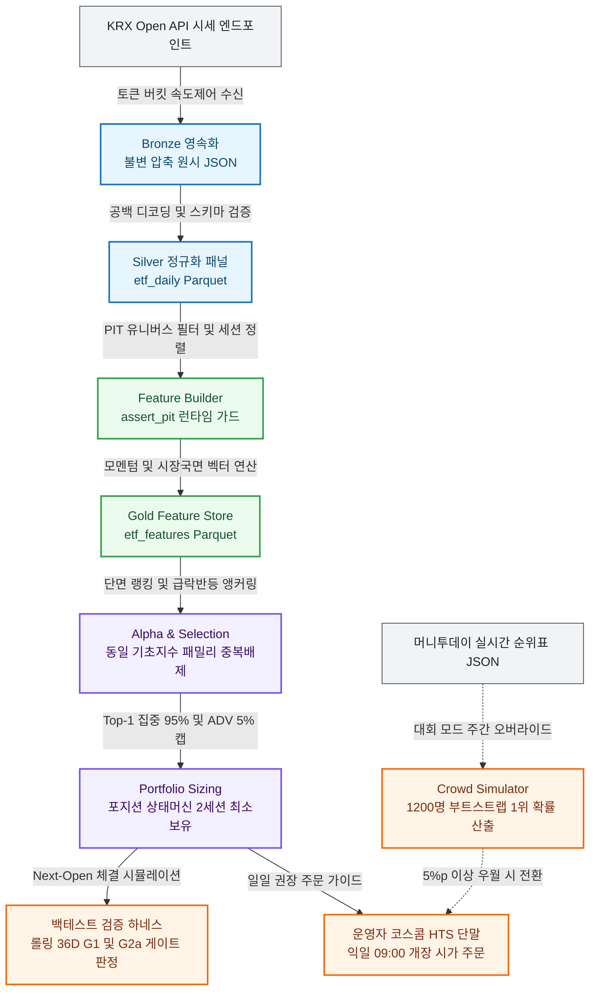

# mt-etf-king-2026: Tournament Quant Research & Execution System

> **머니투데이 제3회 ETF 투자왕 대회(2026) 우승을 위한 단기 토너먼트 특화 퀀트 리서치 & 익일 시가 체결(Next-Open) 운용 파이프라인**


---

## 1. System Highlights

| 핵심 엔지니어링 지표 | 실측 성과 / 보장 기준 | 아키텍처 불변식 및 강제 장치 |
| :--- | :---: | :--- |
| 📈 **도메인 성과 (30% 초과 우측 꼬리)** | **`7.77%`** (B0 대비 3배, +5.23%p) | `sticky.mom60_post_crash_anchor` (평시 60일 모멘텀 + 급락 반등 20일 앵커 슬리브) |
| 🛡️ **안정성/생존 (파산 제약 준수)** | **`0회`** (CVaR 5% **`-21.56%`**) | 15% 하드 손절 가드 + 일일 거래대금(ADV) 5% 참여율 캡을 통한 극단 손실(G2a) 차단 |
| ⚡ **성능/처리속도 (2,097개 롤링 완주)** | **`수 초`** (초고속 인메모리 벡터화) | Polars 지연 평가(LazyFrame) 컬럼너 멀티스레드 연산 + In-Process Parquet |
| 🚀 **운영 연속성 (프로세스 재시동 정합성)** | **`0건`** (포지션 공백 및 해시 불일치) | `PositionStateManager` 상태 지문 검증 + 최소 2세션 보유 가드로 회전율 통제 |
| ⏱️ **시계열 정합성 (미래 참조 누출 오차)** | **`오차 0초`** (Fail-Closed) | 런타임 `assert_pit(df, date)` 가드 강제 + 익일 개장 시가($t+1$ 09:00) 체결 엔진 |
| 🔒 **품질/리스크 (타입 오류 및 결측치 왜곡)** | **`0.00%`** (결측치 0 왜곡 원천 차단) | `mypy --strict` 전수 검증, 공백 디코딩(`""` $\to$ `None`) 및 거래소 캘린더 세션 정렬 |

---

## 2. Tech Stack

| 분류 | 기술 | 채택 근거 및 트레이드오프 |
| :--- | :--- | :--- |
| **Language & Tooling** | `Python 3.11+`, `uv` | CPython 3.11+ 고속 바이트코드 활용 및 `uv`를 통한 초고속 결정론적 가상환경 동기화 |
| **Data Engine & Storage** | `Polars`, `Parquet`, `zstd` | RDBMS 데몬 의존성 없이 Arrow 멀티스레드 컬럼너 벡터화로 수백만 행 단면 랭킹 초 단위 완주 |
| **Concurrency & Network** | `asyncio`, `httpx` | KRX Open API 비동기 수신, 토큰 버킷 속도 제어(초당 2~5회) 및 쿼터 장부(`QuotaLedger`) 초과 차단 |
| **Domain Engine** | `NextOpenExecution`, `StickyEngine` | 당일 종가 동시체결(Look-Ahead) 배제, 동일 기초지수 레버리지 패밀리 중복 제거(Family Dedup) |
| **Live Tournament Override** | `CrowdSimulator`, `LeaderboardArchive` | 단기 계단형 상금 맞춤 ~1,200명 부트스트랩 군중 시뮬레이션 기반 주간 $P(\text{rank}=1)$ 직접 추정 |
| **Verification & Quality** | `pytest`, `mypy (strict)`, `AST Guards` | 1,200+개 테스트, Python AST 기반 상위 계층 역참조 차단(ARCH-1/INV-24), 모듈 구문 버짓(400개) 강제 |

---

## 3. Daily Workflow & Pipeline

| 시각 | 단계 | 핵심 처리 내용 |
| :---: | :--- | :--- |
| 🌅 **15:30 KST** | **장 마감 및 데이터 확정** | 당일 거래 세션 정규장 마감 $\to$ KRX ETF/지수 OHLCV, NAV, 거래대금 확정 |
| ⚡ **16:00 KST** | **수집 및 정규화 (배치)** | 토큰 버킷 속도 제어로 시세 수집 $\to$ 불변 Bronze(`.json.gz`) $\to$ 결측 공백 디코딩 후 Silver Parquet 병합 |
| 🌙 **16:03 KST** | **피처 연산 및 의사결정** | `assert_pit` 가드 검증 $\to$ Gold 벡터 피처 $\to$ 챔피언 룰 스코어링 $\to$ 포지션 상태 연속성 검증 |
| 🛡️ **09:00 KST** | **집행 및 라이브 오버라이드** | 익일 개장 시가 HTS 주문 집행 *(대회 모드 활성 시 토요일 10:00 주간 1위 확률 결정 카드로 대체)* |



---

## 4. Top 5 Real-world Engineering Invariants (핵심 챌린지)

### 1. 미래 참조 편향(Look-Ahead Bias) 원천 배제
* 🚨 **문제**: 당일 종가 시그널을 당일 종가에 즉시 체결시키는 백테스트(Same-bar Fill)는 마감 직전 호가를 미리 알아야 하는 비현실적 편향으로 수익률을 심각하게 과대포장함.
* 📐 **원칙**: 시그널 확정 시점($t$ 15:30 이후)과 주문 집행 시점($t+1$ 09:00 개장 시가)을 시계열 축에서 엄격히 분리함.
* 💡 **해결**: `NextOpenExecution` 엔진을 구축하여 오버나이트 갭 및 슬리피지(3~10 bps)를 반영하고, 런타임 `assert_pit(frame, decision_date)` 가드를 통해 미래 데이터 유입 시 즉시 Fail-Closed 예외를 발생시킴.

### 2. 금융 시계열 결측 왜곡 및 KRX 거래소 API 특이점 방어
* 🚨 **문제**: KRX API의 결측 공백(`""`)을 부동소수점(`0.0`)으로 자동 변환 시 -100% 수익률 왜곡이 발생하며, 휴장일에도 1,163행의 가격 없는 더미 레코드가 유입되어 시계열을 오염시킴.
* 📐 **원칙**: 결측치는 0이 아닌 `None`으로 엄격히 격리하며, 유효 거래 데이터만 롤링 연산에 포함함.
* 💡 **해결**: `DatasetSchema`에서 공백을 `None`으로 강제 디코딩하고, 유효 가격 비율 미달 시 휴장일 응답을 자동 폐기함. 또한 XKRX 캘린더 세션 정렬을 통해 결측 세션의 NaN 전파를 차단함.

### 3. 시장 급락 후 급반등 국면에서의 모멘텀 철수 결함 해결
* 🚨 **문제**: 60일 장기 모멘텀 전략은 평시 우수하나, 시장 급락 직후 단기 급반등 국면에서 `mom60 < 0`으로 인해 100% 현금으로 철수하여 이후 강력한 V자 반등을 놓치는 구조적 결함이 존재함.
* 📐 **원칙**: 시장 레짐(Regime) 전환을 감지하여 평시 모멘텀과 급락 반등 앵커를 적응형으로 스위칭함.
* 💡 **해결**: `sticky.mom60_post_crash_anchor` 챔피언 전략을 도입, 급락 후 반등 국면(CRASH_REBOUND) 진입 시 대표 지수 레버리지를 20일 모멘텀으로 앵커링하고 15% 손절 가드로 방어하여 $P(R>30\%)$를 6.78% $\to$ **7.77%**로 개선함.

### 4. 동일 기초지수 레버리지 패밀리 중복 베팅 위험 차단
* 🚨 **문제**: 단면 랭킹 상위권에 동일 기초지수를 추종하는 다중 배수 종목군(1X, 2X, -1X)이 동시 진입하여 단일 팩터 레버리지에 과도하게 편중되는 위험이 발생함.
* 📐 **원칙**: 동일 기초자산 클러스터 내에서는 가장 강한 모멘텀을 가진 최상위 1개 종목만 선택함.
* 💡 **해결**: `InstrumentMaster` 기반 레버리지 패밀리 그룹화 및 `ClusterAwareSelection`을 적용하여 중복 매수를 원천 차단하고, Top-1 95% 집중 배분 및 ADV 5% 참여율 상한을 기계적으로 강제함.

### 5. 단기 토너먼트 계단형 상금 구조와 1위 확률($P(\text{rank}=1)$) 괴리 극복
* 🚨 **문제**: 1~2위만 상금을 받는 계단형 구조에서 일반적인 변동성 축소(손절, 비중 분산)는 참가자 ~1,200명 대비 $P(\text{rank}=1)$을 1~5%로 심각하게 억제함.
* 📐 **원칙**: 실시간 순위표 군중을 통계적으로 재현하여 1위 달성 확률을 직접 목적함수로 최적화함.
* 💡 **해결**: `src/contest/` 모듈을 신설, MT 순위표 불변 아카이브와 블록 부트스트랩 군중 시뮬레이션을 결합하여 주간 단위로 후보 종목별 $P(\text{rank}=1)$을 산출하고, 5%p 이상 우월할 때만 전환하는 히스테리시스 오버라이드를 구축함.

---

## 5. Verified Performance Matrix (실측 정본 성과)

> **출처**: `docs/results/runs_registry.jsonl` (총 2,097개 롤링 36거래일 윈도우, 2018-01-02 ~ 2026-09-10)  
> **조건**: Next-Open 시가 체결, 거래 수수료(1.5~3.0 bps), 슬리피지(3~10 bps), 20일 ADV 5% 참여율 상한

| 전략 모델 (Model Key) | 평가 윈도우 | $P(R_{36d} > 30\%)$ | $P(R_{36d} > 40\%)$ | $P(R_{36d} > 50\%)$ | 상위 5% 분위수 ($q_{95}$) | Worst 5% 손실 (CVaR) | Objective Gate |
| :--- | :---: | :---: | :---: | :---: | :---: | :---: | :---: |
| **`baseline.buy_hold` (B0)** | 2,088 | 2.54% | 1.25% | 0.48% | +21.01% | -15.09% | **FAIL** |
| **`baseline.mom20_top1` (B1)** | 2,088 | 3.83% | 2.97% | 2.39% | +21.88% | -24.78% | **FAIL** |
| **`sticky.mom60_raw` (P27)** | 2,095 | 6.78% | 5.92% | 4.96% | +49.51% | -23.16% | **PASS** |
| **`sticky.mom60_post_crash_anchor` (Champion)** | **2,097** | **7.77%** | **5.87%** | **4.43%** | **+43.85%** | **-21.56%** | **PASS** |

---

## 6. Architecture Layer Contracts

```text
Layer 8: CLI 진입점 & 운영 대시보드 (`src/cli/`)
   ↓
Layer 6-7: 백테스트 시뮬레이터 & 토너먼트 하네스 (`src/backtest/`, `src/tournament/`)
   ↓
Layer 4-5: 알파 모델, 포트폴리오 비중 & 레버리지 패밀리 정책 (`src/alpha/`, `src/portfolio/`)
   ↓
Layer 2-3: PIT 유니버스 & 벡터 피처 엔진 (`src/universe/`, `src/features/`)
   ↓
Layer 0-1: 인프라 기반, 거래소 캘린더 & 데이터 정규화 스토리지 (`src/core/`, `src/data/`)
────────────────────────────────────────────────────────────────────────
[Live Contest Override] Layer 9: 순위표 아카이브 & 군중 시뮬레이션 (`src/contest/`)
```

* **정적 레이어 경계 검증**: `tests/unit/architecture/test_layer_boundaries.py` (AST 기반 상위 계층 역참조 방지)
* **모듈 라인 버짓 제약**: `tests/unit/architecture/test_module_line_budget.py` (단일 모듈 구문 400개 제한)
* **정세한 아키텍처 상세 문서**: [`docs/architecture/system-design.md`](docs/architecture/system-design.md), [`docs/architecture/engineering-decisions.md`](docs/architecture/engineering-decisions.md)

---

## 7. Quick Start & Verification

```bash
# 1. 의존성 설치 및 환경 동기화
uv sync

# 2. 정적 타입 검증 및 불변식 테스트 스위트 실행
uv run mypy src
uv run pytest tests/unit -m "not slow" -q

# 3. 장 마감 후 원스톱 자동 배치 실행 (수집 -> 정규화 -> 피처 -> 의사결정)
uv run mt-etf daily-refresh --decide --as-of 2026-09-10

# 4. [2026 Live] 주간 1위 확률 기반 실전 결정 카드 산출
uv run mt-etf contest-weekly
```
