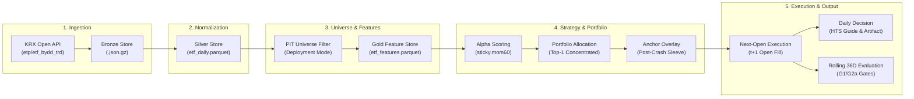

# mt-etf-king-2026: Tournament Quant Research & Execution System

> **머니투데이 제3회 ETF 투자왕 대회(2026) 우승을 목표로 설계된 토너먼트 특화 퀀트 리서치 및 일일 운용 파이프라인**

---

## 1. Project Overview

본 프로젝트는 머니투데이 제3회 ETF 투자왕 대회(2026-09-21 ~ 2026-11-13, 36 거래세션, 초기 자본금 10억 원, 자율형 부문)에 출전하여 **1위(대상) 또는 2위(최우수상) 순위에 진입할 확률을 극대화**하기 위해 개발된 퀀트 리서치 및 자동 의사결정 시스템입니다.

일반적인 펀드 운용(Sharpe 극대화, 변동성 최소화)과 달리, 단기 대회의 계단형 상금 구조에 맞춰 **36거래일 우측 꼬리 수익률($P(R_{36d} > 30\\%)$) 극대화**를 핵심 목적함수로 정의했습니다. 한국거래소(KRX) Open API 데이터 수집부터 Point-in-Time 유니버스 선별, 벡터화 피처 연산, 국면 적응형 모멘텀 전략, 그리고 익일 시가 체결(Next-Open Fill) 시뮬레이션까지 전 과정을 단일 파이프라인으로 구축했습니다.

---

## 2. Why This Project / Problem

### 1) 토너먼트 상금 구조에 따른 목적함수 재정의
대회의 보상 체계는 순위에 대한 계단 함수(Step Function)입니다. 1위(1,000만 원)와 2위(500만 원)를 제외하면 3위나 최하위나 기대 상금은 0원으로 동일합니다. 샤프 지수를 높이기 위해 현금을 분산하거나 저변동성 자산을 편입하는 전통적 포트폴리오는 단기 대회에서 요구되는 높은 수익률(30~50% 이상)에 도달하기 어렵습니다. 따라서 본 시스템은 **우측 꼬리 확률 $P(R_{36d} > 30\\%)$를 극대화하되, 회복 불가능한 손실을 차단하기 위한 파산 제약($P(R < -25\\%) \\le 5\\%$, G2a 게이트)을 결합한 효용 함수**를 설계했습니다.

### 2) 미래 참조 편향(Look-Ahead Bias) 방지와 현실적인 체결 모델링
통상적인 백테스트 프레임워크는 당일 종가 시그널을 당일 종가에 즉시 체결하는 가정을 두는 경우가 많습니다. 그러나 실제 장세에서는 15:30 장 마감 후 수집된 종가 데이터를 바탕으로 시그널을 도출하므로, 현실적인 가장 빠른 체결 시점은 **익일 개장 시가(09:00 Open)**입니다. 본 시스템은 익일 시가 체결 프로토콜(`NextOpenExecution`)을 기본으로 채택하여 오버나이트 변동성과 슬리피지 비용을 백테스트에 충실히 반영합니다.

### 3) 금융 데이터의 Point-in-Time (PIT) 정합성 및 KRX 특이사항 대응
KRX Open API는 정규 휴장일에도 1,163행의 공백 가격 레코드를 반환하거나, 결측치를 공백 문자열(`""`)로 제공하며, 별도의 상장폐지 이력을 제공하지 않는 등의 데이터 특이점이 있습니다. 이를 0으로 단순 치환할 경우 모멘텀 지표와 가격 시계열이 왜곡됩니다. 본 시스템은 엄격한 스키마 디코딩(`""` $\\to$ `None`), XKRX 캘린더 기반 세션 그리드 정렬(`align_session_grid`), 런타임 `assert_pit` 가드를 통해 시계열 데이터 오염과 누출을 엄격히 방어합니다.

### 4) 금융 시계열의 실효 독립 표본 수(Effective Sample Size) 한계 극복
국내 ETF의 8개년 일별 데이터는 총 행 수로는 수십만 건에 달하지만, 36일 전방 라벨의 시계열 중첩과 기초지수 복제(코스피200, S&P500 등)로 인한 단면 상관관계로 인해 **유효 독립 표본 수는 약 2,400개 수준**에 불과합니다. 이처럼 표본이 제한된 환경에서 복잡한 딥러닝 모델을 사용할 경우 과적합 위험이 급증합니다. 따라서 본 시스템은 단면 순위 학습에 특화된 얕은 GBDT(LightGBM Ranker)에 엄격한 모델 용량 제약을 부과하고, 룰 기반 베이스라인과 동일한 검증 프로토콜 하에서 비교 평가합니다.

---

## 3. Key Features

* **Point-in-Time 무결성 파이프라인**  
  *구현*: `assert_pit` 런타임 가드, XKRX 개장일 정렬, 팬텀 세션 선별 필터링([`src/features/pit.py`](src/features/pit.py))  
  *엔지니어링 의미*: 미래 시점 데이터 유입이나 거래소 임시 휴장으로 인한 결측 왜곡 발생 시 즉시 예외를 발생시키는 Fail-closed 구조를 확립했습니다.

* **Next-Open 체결 엔진 및 슬리피지 모델링**  
  *구현*: $t$일 종가 시그널 $\\to$ $t+1$일 09:00 시가 체결 및 거래정지/결측 종목 체결 불가 처리([`src/backtest/execution.py`](src/backtest/execution.py))  
  *엔지니어링 의미*: 실현 불가능한 당일 종가 동시체결 가정을 배제하고, 개장 시가 갭과 슬리피지(3~10 bps)를 고려한 현실적인 백테스트를 수행합니다.

* **연구용과 실전용 유니버스 분리 (Structural vs Deployment)**  
  *구현*: 팩터 유효성 검증을 위한 전체 상장 패널(`structural`)과 대회 후원 10개 운용사 브랜드 및 유동성(ADV $\\ge$ 1억 원) 충족 패널(`deployment`)을 분리([`src/universe/provider.py`](src/universe/provider.py))  
  *엔지니어링 의미*: 생존자 편향 없는 알파 발굴과 실제 계좌에서 주문 가능한 종목군 간의 간극을 해소했습니다.

* **급락 후 반등 앵커 전략 (`sticky.mom60_post_crash_anchor`)**  
  *구현*: 평시 60일 모멘텀 랭킹을 유지하되, 지수 급락 후 반등 국면(CRASH_REBOUND) 진입 시 대표 레버리지(코스닥150레버리지, KODEX 레버리지)를 앵커링하고 20일 드로우다운 15% 손절 가드를 적용([`src/strategies/sticky/model_runner.py`](src/strategies/sticky/model_runner.py))  
  *엔지니어링 의미*: 급락 직후 장기 모멘텀 전략이 현금으로 과도하게 철수하여 반등 기회를 놓치는 구조적 한계를 보완하여 $P(R>30\\%)$를 6.78%에서 **7.77%**로 개선했습니다.

* **동일 기초지수 레버리지 패밀리 중복 제거 (LeverageFamily Deduplication)**  
  *구현*: 기초지수명(`IDX_IND_NM`) 기준으로 1X, 2X, -1X, -2X 종목을 그룹화하여 상위 1개 종목만 포트폴리오에 진입([`src/portfolio/selection.py`](src/portfolio/selection.py))  
  *엔지니어링 의미*: 동일 지수에 대한 중복 베팅으로 인해 포트폴리오의 실효 익스포저가 특정 팩터에 편중되는 위험을 방지합니다.

* **장 마감 후 일일 배치 파이프라인 (`daily-refresh`)**  
  *구현*: KRX Ingestion $\\to$ Normalization $\\to$ Feature Rebuild $\\to$ Decision Recommendation 전체 흐름 자동화([`src/cli/commands/pipeline.py`](src/cli/commands/pipeline.py))  
  *엔지니어링 의미*: 16:00 KST에 단일 CLI 명령 또는 systemd 타이머 스케줄러를 통해 데이터 갱신부터 익일 주문 가이드 산출까지 한 번에 완료합니다.

---

## 4. Architecture



---

## 5. End-to-End Runtime Flow

```text
1. Raw Market Data Ingestion
   └── src/data/providers/krx.py -> src/data/bronze.py (Write-once gzip JSON)
2. Schema Normalization & Validation
   └── src/data/silver.py -> src/data/schema.py (Strict typing, "" -> None, Silver Parquet)
3. Point-in-Time Universe Selection
   └── src/universe/provider.py -> src/universe/instruments.py (Sponsor filter, ADV >= 1억)
4. Gold Feature Generation
   └── src/features/builder.py -> src/features/pit.py (assert_pit, Momentum, Volatility, Regime)
5. Alpha Model Scoring
   └── src/strategies/sticky/model.py -> src/alpha/base.py (Cross-sectional rank)
6. Portfolio Selection & Constraints
   └── src/portfolio/selection.py -> src/portfolio/sizing.py (Family dedup, ADV 5% cap)
7. State Persistence & Continuity Check
   └── src/portfolio/state.py -> data/state/*.json (Position continuity fail-closed)
8. Execution Simulation / Daily Decision Rendering
   └── src/backtest/execution.py -> src/cli/commands/decide/render.py (results/decide_daily/*.json)
```

---

## 6. Repository Structure

```text
src/
├── core/                  # 환경설정(SOPS 인메모리 복호화), XKRX 캘린더, DataPaths 불변 경로
├── data/                  # KRX OpenAPI Provider, BronzeStore, SilverBuilder, 스키마 검증
├── universe/              # PointInTimeUniverse, InstrumentMaster, LeverageFamily
├── features/              # FeatureBuilder, PIT 가드, 모멘텀/변동성/브레드스/시장국면 연산
├── alpha/                 # AlphaModel 프로토콜, LightGBM Ranker
├── portfolio/             # ClusterAwareSelection, 비중 산출, ADV 유동성 제약, 상태머신
├── strategies/            # 전략 레지스트리, B0~B5 베이스라인, 챔피언 sticky 전략군
├── backtest/              # BacktestEngine, NextOpenExecution, 슬리피지/수수료 모델
├── tournament/            # Rolling-36D 시뮬레이터, G1/G2a 게이트, LOYO 평가 엔진
├── execution/             # 체결 현금 회계(CashAccounting), 원장 상태 전이
├── reporting/             # 대시보드 렌더링, 꼬리 위험 포렌식, 실행 Trace 기록
└── cli/                   # 15개 서브커맨드 CLI 인터페이스 (main, parser, commands)

configs/                   # 전략 파라미터, 게이트 기준, 유니버스 설정 YAML
deploy/systemd/            # 장 마감 후 정기 배치를 위한 systemd service/timer
docs/                      # 아키텍처 심층 문서 및 지식베이스
scripts/                   # 일일 배치 실행 쉘 스크립트 (daily_pipeline.sh)
tests/                     # 1,210개 단위·통합·속성기반(Hypothesis) 테스트
```

---

## 7. Technical Decisions (ADR Summary)

### Decision 1: 샤프 지수 대신 36거래일 롤링 우측 꼬리 확률($P(R > 30\\%)$) 최적화
* **배경 및 근거**: 8주 단기 대회의 상금 구조는 1~2위에만 집중된 계단 함수이므로, 변동성을 낮추는 일반 펀드형 자산 배분 전략은 대회 상금 기대값이 0에 가깝습니다.
* **트레이드오프**: 포트폴리오의 일별 변동성과 MDD가 상대적으로 높아지므로, 이를 제어하기 위해 $P(R < -25\\%) \\le 5\\%$라는 엄격한 파산 제약(G2a)을 안전장치로 병행 적용했습니다.

### Decision 2: $t$일 종가 시그널 $\\to$ $t+1$일 시가 체결(Next-Open Fill) 채택
* **배경 및 근거**: 당일 종가 시그널을 당일 종가에 즉시 체결하는 비현실적인 가정을 배제하고, 장 마감 후 분석을 거쳐 익일 개장 시가에 주문을 체결하는 실전 운영 흐름을 모델링했습니다.
* **트레이드오프**: 익일 개장 전 발생하는 오버나이트 갭 변동과 개장 직후의 슬리피지 리스크를 감수해야 합니다.

### Decision 3: Parquet 및 In-Memory Polars 기반 단일 머신 파이프라인
* **배경 및 근거**: 별도의 RDBMS 데몬 설치나 네트워크 오버헤드 없이 `uv sync`만으로 즉시 재현 가능하며, Polars 컬럼너 벡터 연산을 통해 수백만 행의 단면 랭킹과 롤링 백테스트를 수 초 내에 처리합니다.
* **트레이드오프**: 행 단위의 실시간 트랜잭션 업데이트(OLTP)가 어려우므로, 일별 배치 시 증분 Append 및 파티션 재구축 방식을 사용합니다.

### Decision 4: 딥러닝 배제 및 엄격한 용량 제한의 GBDT Ranker 채택
* **배경 및 근거**: 8개년 ETF 데이터의 유효 독립 표본 수($n_{\\text{effective}}$)는 약 2,400개에 불과하여, 파라미터 수가 많은 심층 신경망이나 강화학습 모델은 시장 노이즈에 과적합될 위험이 매우 큽니다.
* **트레이드오프**: 비정형 데이터 활용은 제한되나, Purged Walk-Forward CV 하에서 일반화 성능이 통계적으로 검증된 모델만을 배포합니다.

---

## 8. Validation & Reliability

* **1,210개 전수 테스트 통과**: Unit, Integration, Hypothesis 속성 기반 테스트 스위트가 구축되어 있습니다.
* **엄격한 정적 타입 검증 (`mypy --strict`)**: 210개 전체 Python 소스 파일에 대해 타입 오류 0건을 유지합니다.
* **Point-in-Time 런타임 가드**: 모든 피처 연산 진입 시 `assert_pit(df, decision_date)`를 실행하여 미래 데이터 누출을 차단합니다.
* **Fail-Closed 예외 처리**: 결측값 공백은 0으로 채우지 않고 `None` 처리하며, 휴장일 더미 응답은 자동으로 식별하여 제외합니다.
* **Leave-One-Year-Out (LOYO) 교차 검증**: 특정 연도의 대세 상승장에 편향되지 않도록 연도별 out-of-sample 강건성을 평가합니다.
* **다축 Robustness Grid 검증**: 수수료(1.5~3 bps), 슬리피지(3~10 bps), 유동성 참여율(1%, 2%, 5%) 등 36개 파라미터 조합에 대해 스트레스 테스트를 수행합니다.

---

## 9. Empirical Results

2018-01-02부터 2026-09-10까지 총 2,097개 롤링 36거래일 윈도우에서 실측된 공식 백테스트 결과입니다 ([`docs/results/runs_registry.jsonl`](docs/results/runs_registry.jsonl)).

| 전략 모델 (Model Key) | 평가 윈도우 | $P(R_{36d} > 30\\%)$ | $P(R_{36d} > 40\\%)$ | $P(R_{36d} > 50\\%)$ | 상위 5% 분위수 ($q_{95}$) | Worst 5% 꼬리손실 (CVaR) | Objective Gate |
| :--- | :---: | :---: | :---: | :---: | :---: | :---: | :---: |
| **`baseline.buy_hold` (B0)** | 2,088 | 2.54% | 1.25% | 0.48% | +21.01% | -15.09% | **FAIL** |
| **`baseline.mom20_top1` (B1)** | 2,088 | 3.83% | 2.97% | 2.39% | +21.88% | -24.78% | **FAIL** |
| **`sticky.mom60_raw` (P27)** | 2,095 | 6.78% | 5.92% | 4.96% | +49.51% | -23.16% | **PASS** |
| **`sticky.mom60_post_crash_anchor` (Champion)** | **2,097** | **7.77%** | **5.87%** | **4.43%** | **+43.85%** | **-21.56%** | **PASS** |

* **우승 목표 달성률 향상**: 챔피언 전략은 단순 보유(B0) 대비 30% 초과 수익 달성 확률이 **+5.23%p (3배 이상)** 향상되었습니다.
* **파산 위험 통제**: CVaR(5%)이 -21.56%로 유지되어 파산 기준(-25%) 이내로 위험이 관리되었습니다.

---

## 10. Getting Started

### 요구 환경
* Linux / macOS
* Python $\\ge$ 3.11
* [`uv`](https://github.com/astral-sh/uv) 패키지 매니저

### 설치 및 검증
```bash
# 1. 저장소 복제 및 의존성 설치
git clone https://github.com/KTHYEONG/mt-etf-king-2026.git
cd mt-etf-king-2026
uv sync

# 2. 시스템 설정 및 SOPS 복호화 환경 점검
uv run mt-etf config-check

# 3. 정적 분석 및 테스트 실행
uv run ruff check
uv run mypy src
uv run pytest tests/unit -m "not slow" -q
```

### 주요 CLI 실행 명령어
```bash
# 1. 일일 마감 후 원스톱 배치 실행 (수집 -> 정규화 -> 피처 -> 의사결정 추천)
uv run mt-etf daily-refresh --decide --as-of 2026-09-10

# 2. 특정 일자 기준 챔피언 전략의 목표 포트폴리오 및 추정 주문량 산출
uv run mt-etf decide --date 2026-09-10

# 3. 챔피언 전략 롤링 36거래일 토너먼트 백테스트 실행
uv run mt-etf backtest --model sticky.mom60_post_crash_anchor --start 2018-01-02 --end 2026-09-10

# 4. Leave-One-Year-Out (LOYO) 연도별 강건성 검증
uv run mt-etf loyo --run-id <RUN_ID>
```

---

## 11. Documentation

세부 아키텍처 및 엔지니어링 분석 문서는 `docs/architecture/`를 참조하십시오.

* **[`docs/architecture/overview.md`](docs/architecture/overview.md)**: 전체 시스템 토폴로지, 목적 함수, 런타임 흐름 상세
* **[`docs/architecture/data-flow.md`](docs/architecture/data-flow.md)**: 데이터 파이프라인 단계별 I/O, 시계열 무결성 및 스키마 명세
* **[`docs/architecture/components.md`](docs/architecture/components.md)**: 10대 핵심 컴포넌트별 인터페이스, 의존성 및 구현 클래스
* **[`docs/architecture/design-decisions.md`](docs/architecture/design-decisions.md)**: 핵심 엔지니어링 의사결정 기록 (ADR)
* **[`docs/knowledge/mt-data-report.md`](docs/knowledge/mt-data-report.md)**: 대회 공식 규정 및 지식베이스 온톨로지

---

## 12. Limitations

* **한국거래소(KRX) OpenAPI 단일 의존성**: KRX 오픈 API 서버의 일시적인 응답 지연이나 정기 점검 시간대에는 일일 데이터 수집이 지연될 수 있습니다.
* **최종 HTS 주문 수동 입력**: 코스콤 모의투자 시스템이 주문 전용 OpenAPI를 제공하지 않으므로, 데일리 대시보드가 생성한 목표 주수와 금액을 운영자가 HTS에 직접 입력하는 운영 방식을 유지합니다.
* **오버나이트 갭 모델 단순화**: 백테스트 체결 모델은 개장 시가(Open)를 기준으로 하되 슬리피지를 가산하지만, 개장 직후 발생하는 호가 공백이나 극단적인 시가 갭을 틱 단위 오더북 수준으로 복원하지는 못합니다.
