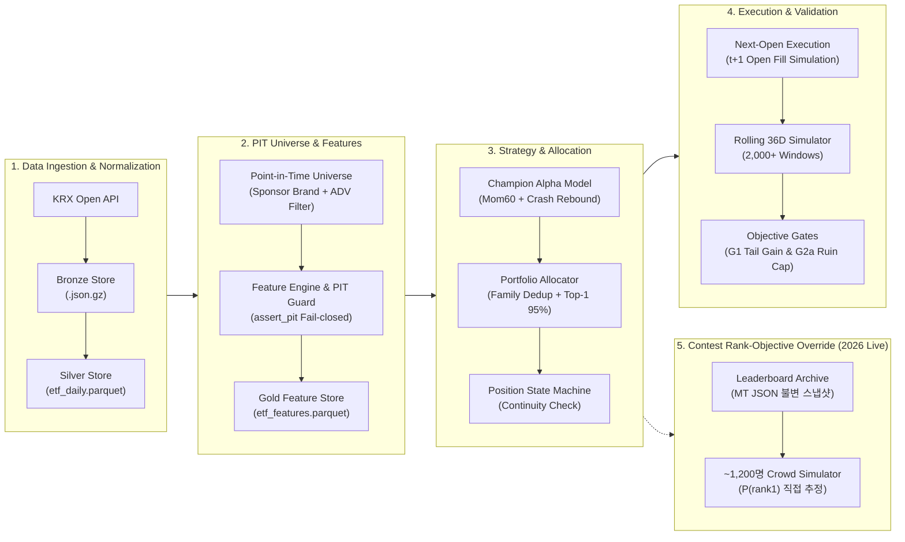
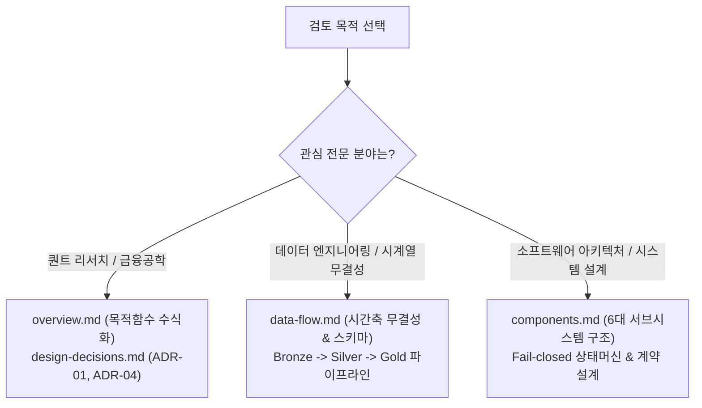

# Architecture Documentation Index

> **머니투데이 제3회 ETF 투자왕 대회(2026) 출전을 위해 구축된 Tournament Quant Research & Execution System의 시스템 아키텍처 포털**

본 문서군은 기술 면접관, 채용 담당자 및 퀀트 시스템 엔지니어가 2~3분 내에 시스템의 핵심 설계 의도, 엔지니어링 결정, 그리고 시계열 무결성 방어 메커니즘을 한눈에 파악할 수 있도록 체계화된 기술 문서 모음입니다.

---

## 1. System Topology at a Glance

---

## 2. 면접관을 위한 3분 퀵 내비게이션 (Reading Guide)

평가하고자 하는 기술 전문 분야에 따라 아래 추천 문서를 우선 검토하시기 바랍니다.

| 검토 초점 | 추천 문서 | 핵심 확인 포인트 |
| :--- | :--- | :--- |
| **퀀트 & 트레이딩 로직** | **[`overview.md`](overview.md)** **[`design-decisions.md`](design-decisions.md)** | • 계단형 상금 구조에 맞춘 우측 꼬리 확률($P(R_{36d} > 30\%)$) 최적화 • 급락 후 반등 국면(CRASH_REBOUND) 앵커링 전략 메커니즘 • 2,097개 롤링 윈도우 기반 실측 검증 성과 |
| **데이터 엔지니어링** | **[`data-flow.md`](data-flow.md)** | • Event Time ($t$ 15:30) $\to$ Processing Time ($t$ 16:00) $\to$ Execution Time ($t+1$ 09:00) • `assert_pit` 가드 및 XKRX 캘린더 세션 정렬을 통한 누출 방지 • KRX 결측치 디코딩(`""` $\to$ `None`) 및 휴장일 더미 레코드 차단 |
| **소프트웨어 아키텍처** | **[`components.md`](components.md)** | • Ingestion $\to$ Feature $\to$ Alpha $\to$ Portfolio $\to$ Backtest 관심사 분리 • Polars In-Memory 컬럼너 파이프라인 및 Parquet 파일 시스템 • 프로세스 재시작 간 포지션 연속성 검증 및 Fail-closed 방어 체계 |
| **대회 실전 라이브 로직** | **[`design-decisions.md#adr-08`](design-decisions.md)** **[`components.md §7`](components.md)** | • 임계값 확률 최적화(ADR-01)가 실측 $P(\text{rank}=1)$ 1~5%에 그친 근거 • ~1,200명 순위 상대 시뮬레이션과 주간 결정 카드 파이프라인 |

---

## 3. 핵심 아키텍처 문서 목록

| 문서 | 핵심 내용 | 주요 대상 |
| :--- | :--- | :--- |
| **[`overview.md`](overview.md)** | 시스템 목적함수, 계층별 시스템 토폴로지, 엔드투엔드 운영 흐름, 외부 의존성 | 시스템 전체 구조 및 대회 경제적 목적 파악 |
| **[`data-flow.md`](data-flow.md)** | Bronze $\to$ Silver $\to$ Gold 파이프라인 단계별 입출력, 시간 축 정합성 및 시계열 무결성 가드 | 데이터 엔지니어링 및 시계열 무결성 검증 |
| **[`components.md`](components.md)** | 6대 핵심 서브시스템별 책임, 인터페이스, 불변식(Invariants) 및 장애 방어 메커니즘 | 모듈 간 결합도 및 소프트웨어 설계 검토 |
| **[`design-decisions.md`](design-decisions.md)** | 토너먼트 목적함수, Next-Open 체결, 듀얼 유니버스, 앵커 슬리브, Polars/Parquet 등 핵심 ADR | 아키텍처 트레이드오프 및 설계 근거 심층 검토 |

---

## 4. 도메인 참조 문서

* **[`mt-data-report.md`](../knowledge/mt-data-report.md)**: 머니투데이 대회 공식 규정 분석, 역대 대회 통계 분석 및 제약조건 지식베이스 (Knowledge Base)
