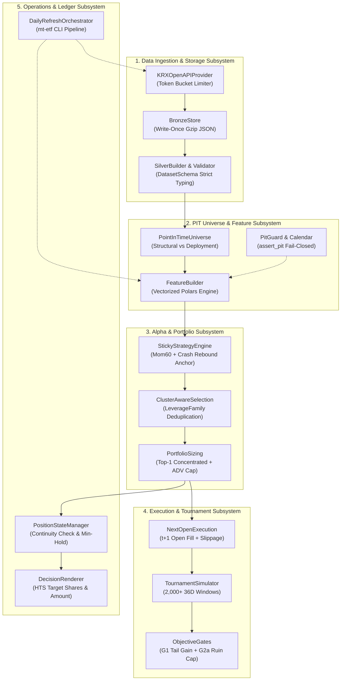

# Component Architecture & Subsystems

본 문서는 시스템을 구성하는 핵심 모듈들의 책임(Responsibility), 상호작용 인터페이스, 불변식(Invariants) 및 예외 방어 메커니즘을 5대 핵심 서브시스템 단위로 정리합니다.

---

## 1. Subsystem Topology & Layer Interactions

---

## 2. Subsystem 1: Data Ingestion & Storage

외부 거래소(KRX) API로부터 원시 시세를 수집하고, 정규화된 시계열 Parquet 테이블로 변환하는 계층입니다.

| 컴포넌트 | 핵심 책임 | 핵심 인터페이스 (Input / Output) | 장애 방어 및 불변식 (Fail-Closed) |
| :--- | :--- | :--- | :--- |
| **`KRXOpenAPIProvider`** | • KRX 오픈 API HTTP 통신 • 일일 호출 쿼터 추적 및 속도 제한 | **In**: API 엔드포인트, 조회 일자 **Out**: 원시 응답 JSON 페이로드 | • **Token Bucket Rate Limiter**: 초당 2~5회 준수 • **QuotaLedger**: 일일 쿼터 초과 시 호출 차단 |
| **`BronzeStore`** | • 원시 수집 데이터 영속화 | **In**: 원시 JSON Envelope **Out**: 불변 압축 파일 (`.json.gz`) | • **Write-Once 불변성**: 덮어쓰기 금지, 감사 추적성 보장 |
| **`SilverBuilder` & `DatasetSchema`** | • 스키마 파싱 및 정규화 • 증분 Parquet 병합 | **In**: Bronze JSON 파일들 **Out**: `etf_daily.parquet`, `index_daily.parquet` | • **공백 디코딩**: 결측 공백(`""`)을 `None`으로 변환 (0.0 왜곡 차단) • **휴장일 더미 레코드 필터**: 유효 가격 비율 미달 시 자동 폐기 |

---

## 3. Subsystem 2: Point-in-Time Universe & Features

시계열 누출(Look-Ahead Bias)과 생존자 편향(Survivorship Bias) 없이 팩터 및 시장 국면 지표를 생성하는 계층입니다.

| 컴포넌트 | 핵심 책임 | 핵심 인터페이스 (Input / Output) | 장애 방어 및 불변식 (Fail-Closed) |
| :--- | :--- | :--- | :--- |
| **`PointInTimeUniverse`** | • 결정 시점($t$) 기준 생존 및 거래 가능 종목 확정 • 모드별 유니버스 분리 | **In**: Silver 패널, 기준 일자($t$) **Out**: $t$일 적격 종목 리스트 | • **Dual-Mode 분리**: 순수 연구용(`structural`) vs 실전 주문용(`deployment`) 엄격 분리 • **생존자 편향 차단**: 상장폐지 이전 거래 세션만 허용 |
| **`InstrumentMaster` & `LeverageFamily`** | • ETF 기초자산 및 배수 메타데이터 관리 • 레버리지 패밀리 그룹화 | **In**: 종목 마스터 메타데이터 **Out**: 기초지수별 1X/2X/-1X/-2X 맵 | • **패밀리 식별**: 동일 기초지수 종목군을 단일 패밀리 키로 그룹화하여 중복 매수 제어 |
| **`FeatureBuilder` & `PitGuard`** | • 단면 및 시계열 피처 고속 벡터 연산 • 5단계 시장 국면(Regime) 분류 | **In**: Silver 패널, XKRX 캘린더 **Out**: `etf_features.parquet` (Gold) | • **`assert_pit` 가드**: 프레임 내 $date > decision\_date$ 유입 시 즉시 예외 중단 • **팬텀 세션 격리**: 임시 휴장 결측 세션의 NaN 전파 방어 |

---

## 4. Subsystem 3: Alpha Scoring & Portfolio Policy

알파 시그널을 산출하고, 토너먼트 특성에 부합하는 포트폴리오 비중으로 최적화하는 계층입니다.

| 컴포넌트 | 핵심 책임 | 핵심 인터페이스 (Input / Output) | 장애 방어 및 불변식 (Fail-Closed) |
| :--- | :--- | :--- | :--- |
| **`StickyStrategyEngine` (Champion)** | • 60일 모멘텀 랭킹 산출 • 급락 후 반등 앵커 슬리브 라우팅 | **In**: Gold 피처 패널, PIT 종목군 **Out**: 종목별 상대강도 스코어 | • **Dual-Sleeve 국면 전환**: 평시 60일 모멘텀 $\to$ 급락 반등 시 대표 레버리지 앵커링 + 15% 손절 가드 |
| **`ClusterAwareSelection`** | • 동일 지수 패밀리 중복 제거 • 포트폴리오 종목 선별 | **In**: 알파 스코어, 종목 패밀리 맵 **Out**: 편입 대상 종목 집합 | • **Family Deduplication**: 동일 기초지수 내 복수 종목 매수 금지 (최상위 1개만 허용) |
| **`PortfolioSizing`** | • 종목별 목표 비중 확정 • 유동성 및 현금 제약 반영 | **In**: 편입 종목, ADV 통계 **Out**: 종목별 목표 비중 (Target Weights) | • **Top-1 집중 배분**: 단일 종목 최대 95% 배분 (5% 현금 버퍼) • **ADV 5% 참여율 한도**: 일일 주문 규모가 20일 ADV의 5%를 초과할 수 없음 |

---

## 5. Subsystem 4: Execution Simulation & Tournament Harness

실제 체결 괴리를 반영하고, 2,000개 이상의 롤링 윈도우에서 전략의 통계적 강건성을 검증하는 계층입니다.

| 컴포넌트 | 핵심 책임 | 핵심 인터페이스 (Input / Output) | 장애 방어 및 불변식 (Fail-Closed) |
| :--- | :--- | :--- | :--- |
| **`NextOpenExecution`** | • $t+1$일 개장 시가 체결 모델링 • 슬리피지 및 수수료 비용 차감 | **In**: 목표 비중, 익일 시가 패널 **Out**: 체결 내역(Fill), 일별 NAV | • **No Same-Bar Fill**: 당일 종가 동시체결 배제 • **체결 불가(Unfillable) 처리**: 거래정지 및 결측 시가 종목 매매 불가 반영 |
| **`BacktestEngine`** | • 전체 시계열 백테스트 완주 • 파라미터 그리드 캐싱 | **In**: 전략 인스턴스, 비용 설정 **Out**: 시계열 수익률 및 포지션 히스토리 | • **SessionCacheRegistry**: 36개 비용·유동성 그리드 탐색 시 중복 연산 방지 |
| **`TournamentSimulator` & `ObjectiveGates`** | • 롤링 36D 수익률 분포 도출 • G1/G2a 하드 게이트 판정 • Leave-One-Year-Out(LOYO) 검증 | **In**: 백테스트 결과 패널, 게이트 기준 **Out**: 승격 여부 (PASS/FAIL), 분위수 통계 | • **G1 게이트**: $P(R_{36d} > 30\%) \ge B_0 + 2\%p$ • **G2a 파산 게이트**: $P(R_{36d} < -25\%) \le 5\%$ • **LOYO 검증**: 특정 연도에 편향된 과적합 필터링 |

---

## 6. Subsystem 5: Operations & Ledger

매일 16:00 장 마감 후 자동화된 배치 실행과 프로세스 간 상태 연속성을 보장하는 계층입니다.

| 컴포넌트 | 핵심 책임 | 핵심 인터페이스 (Input / Output) | 장애 방어 및 불변식 (Fail-Closed) |
| :--- | :--- | :--- | :--- |
| **`PositionStateManager`** | • 포지션 영속화 및 연속성 검증 • 최소 보유 세션 가드 | **In**: 확정 포지션, 결정 일자 **Out**: 포지션 상태 JSON (`data/state/`) | • **연속성 훼손 시 Fail-Closed**: 전일 상태와 불일치 시 주문 생성 중단 • **최소 보유 기간(2일)**: 불필요한 매매 회전율(Turnover) 방지 |
| **`DailyRefreshOrchestrator`** | • 원스톱 일일 배치 실행 • CLI 명령 라우팅 | **In**: CLI 옵션 (`--as-of`, `--decide`) **Out**: 파이프라인 일괄 완주 | • **원스톱 실행**: 수집 $\to$ 정규화 $\to$ 피처 $\to$ 의사결정 순차 자동화 • **systemd 연동**: 장 마감 후 자동 스케줄링 지원 |
| **`DecisionRenderer`** | • 최종 HTS 주문 가이드 출력 | **In**: 포트폴리오 목표 비중, 당일 종가 **Out**: 터미널 대시보드 및 JSON 아티팩트 | • **정수 주수 변환**: 주문 수량(주) 및 예상 체결 금액을 운영자 가이드로 제공 |
