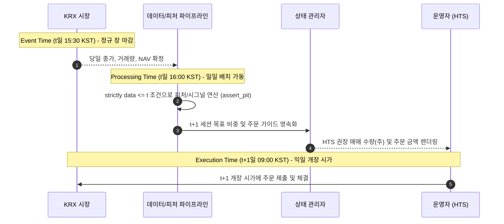

# Data Flow & Temporal Architecture

본 문서는 외부 데이터 소스(KRX Open API)에서 수집된 원시 데이터가 정규화, Point-in-Time 유니버스 선별, 피처 엔지니어링, 전략 스코어링을 거쳐 최종 HTS 주문 가이드로 확정되기까지의 데이터 흐름과 시계열 정합성(Temporal Integrity) 보장 메커니즘을 기술합니다.

---

## 1. End-to-End Data Pipeline Architecture

```mermaid
flowchart LR
    API["KRX Open API\n(etf_bydd_trd, kospi_dd_trd)"] -->|"Token Bucket Rate Limit\nQuota Ledger Check"| Bronze[("Bronze Tier\n불변 Raw JSON Gzip")]
    Bronze -->|"Strict Type Casting\nEmpty String -> None\nHoliday Dummy Reject"| Silver[("Silver Tier\netf_daily.parquet\nindex_daily.parquet")]
    Silver -->|"Point-in-Time Universe Filter\nSponsor Brand & ADV >= 1억"| PIT["Eligible Universe at t\n(UniverseSnapshot)"]
    Silver -->|"assert_pit Guard\nVectorized Polars Engine"| Gold[("Gold Feature Tier\netf_features.parquet")]
    PIT --> Gold
    Gold -->|"Alpha Scoring\nLeverage Family Dedup\nTop-1 95% + ADV 5% Cap"| Port["Target Weights & Orders"]
    Port -->|"Continuity Check\nMin-Hold 2 Days"| State[("State Ledger\nPosition JSON")]
    Port -->|"t+1 Open Fill Simulation"| Backtest["Backtest NAV & Gate Status"]
    State -->|"Render Target Shares/Amount"| Guide["Daily HTS Order Guide"]
```



| 파이프라인 단계 | 입력 (Input) | 핵심 처리 및 무결성 제약 | 출력 (Output) |
| :--- | :--- | :--- | :--- |
| **1. Bronze Ingestion** | KRX OpenAPI JSON | 초당 2~5회 Rate Limiter 준수, 일일 쿼터 확인, 원시 응답 변경 없이 압축 보관 | `data/raw/krx/.../*.json.gz` |
| **2. Silver Normalization** | Bronze JSON envelopes | 휴장일 더미 레코드(1,163행 공백) 필터링, `""` $\to$ `None` 디코딩, 스키마 검증 | `data/normalized/etf_daily.parquet`<br>`data/normalized/index_daily.parquet` |
| **3. PIT Universe Selection** | Silver Parquet + 브랜드 설정 | 상장/생존 기간 판정, 거래정지 제외, 후원 운용사 매칭, 20일 ADV $\ge$ 1억 원 게이트 | $t$일 적격 종목 리스트 (`UniverseSnapshot`) |
| **4. Gold Feature Pipeline** | Silver Panel + Universe + XKRX 달력 | `assert_pit` 가드, 팬텀 세션 격리, 모멘텀·변동성·마켓 브레드스·시장국면 벡터 연산 | `data/features/etf_features.parquet` |
| **5. Alpha Signal Generation** | Gold Feature Panel | 단면 백분위수 랭킹, 지수 모멘텀 필터, 급락 후 반등 앵커 슬리브 룰 평가 | 종목별 상대강도 스코어 |
| **6. Portfolio & Overlay** | Alpha Scores + 이전 포지션 상태 | 동일 지수 레버리지 패밀리 중복 제거, Top-1 집중(최대 95%), ADV 5% 참여율 한도 | 종목별 목표 비중 (Target Weights) |
| **7. Execution & Output** | Target Weights + 시가 패널 | 익일 시가 체결 시뮬레이션(백테스트) 또는 HTS 입력용 수량/금액 렌더링(라이브) | 백테스트 성과 / `results/decide_daily/*.json` |

---

## 2. Temporal Integrity & Timestamp Architecture

금융 퀀트 시스템의 성패를 가르는 가장 핵심적인 엔지니어링 원칙은 **미래 참조 편향(Look-Ahead Bias)**과 **생존자 편향(Survivorship Bias)**의 원천 차단입니다.

### 2.1 3단 시간 축 모델 (Event vs Processing vs Execution Time)



1. **Event Time ($t$)**:
   * 당일 장 마감(15:30 KST) 시점에 거래소에서 확정된 시장 데이터(종가, 거래량, 거래대금, NAV 등).
2. **Processing Time ($t$ 16:00 KST)**:
   * 장 마감 후 실행되는 일일 배치 파이프라인.
   * 결정 시점 이전($\le t$)의 데이터만을 엄격히 입력으로 허용하여 미래 시점 데이터 누출을 방지.
3. **Execution Time ($t+1$ 09:00 KST)**:
   * 체결은 익일 개장 시가(Next Open)에 이루어집니다.
   * 당일 종가 시그널을 당일 종가에 즉시 체결시키는 비현실적인 Same-bar Fill 가정은 코드 레벨에서 원천 배제됩니다.

---

### 2.2 Point-in-Time (PIT) 검증 및 데이터 방어 메커니즘

* 🛡️ **`assert_pit(frame, decision_date)` 런타임 가드**:
  * 모든 피처 연산 및 유니버스 필터 함수 진입 시점에 호출됩니다.
  * 프레임 내에 $date > decision\_date$인 데이터가 1건이라도 포함된 경우 즉시 `PitViolationError`를 발생시키고 실행을 중단(Fail-closed)합니다.

* 📅 **XKRX 캘린더 기반 세션 정렬 (`align_session_grid`)**:
  * 단순 날짜 나열이 아닌 거래소 공식 캘린더(`exchange-calendars` XKRX)를 기준으로 유효 세션 목록을 확정합니다.
  * 종목별 최초 상장일(`first_seen`)과 최종 관측일(`last_seen`) 사이의 개장 세션을 완벽히 결합하여 거래 결측일을 투명하게 노출합니다.

* 🚫 **팬텀 세션(Phantom Session) 선별 처리 (`restrict_to_traded_sessions`)**:
  * 전산 장애나 임시 휴장 등으로 시장 전체 가격이 결측인 세션이 존재할 경우, Polars의 `rolling_*` 연산은 물리적 행 개수를 카운트하므로 이후 윈도우 전체로 NaN이 전파되는 결함이 발생합니다.
  * 피처 엔진은 롤링 연산 전 실제 거래된 세션만을 슬라이싱하여 피처를 산출한 뒤 전체 그리드에 Left Join하여 무결성을 보장합니다.

* 💵 **미수정 실체결가 원칙 (Unadjusted Price Invariant)**:
  * 레버리지/인버스 ETF의 36세션 수익률은 기초지수 수익률의 2배가 아니며, 일별 리밸런싱에 따른 변동성 감쇠(Volatility Drag)가 복합 작용합니다.
  * 지수 수익률에 승수를 곱하는 임의의 합성 가격 생성을 엄격히 배제하며, KRX에서 실제 체결된 시장 가격만을 분석에 사용합니다.

* 🛑 **결측치 및 KRX 비정상 응답 방어 (Fail-Closed)**:
  * **공백 문자열 디코딩**: KRX API는 결측치를 빈 문자열(`""`)로 반환합니다. 이를 `0.0`으로 자동 변환하면 수익률이 -100%로 왜곡되므로, `DatasetSchema`에서 강제로 `None`으로 변환합니다.
  * **휴장일 더미 레코드 필터**: KRX는 휴장일에도 1,163행의 레코드를 반환하지만 모든 가격 필드가 비어 있습니다. 행 수가 아닌 `valid_price_ratio < threshold`를 기준으로 휴장일 응답을 식별하여 폐기합니다.

---

## 3. Storage Layer & Schema Specification

```text
data/
├── raw/krx/                          # [Bronze Tier] 불변 원본 압축 JSON (.json.gz)
├── normalized/                       # [Silver Tier] 정규화된 시계열 패널 (Parquet)
│   ├── etf_daily.parquet             # ETF 일별 OHLCV, NAV, 거래대금, 상장주식수
│   └── index_daily.parquet           # 지수 일별 OHLCV, 시가총액
├── features/                         # [Gold Tier] 피처 엔지니어링 패널 (Parquet)
│   └── etf_features.parquet          # 모멘텀, 변동성, 브레드스, 시장국면 결합
└── state/                            # [Operational Tier] 런타임 연속성 상태 (JSON)
    ├── krx_quota.json                # API 일일 호출량 추적
    └── sticky_mom60_post_crash_anchor_position.json
```

### Silver Tier: `etf_daily.parquet` 핵심 스키마
| 필드명 | 물리 타입 | 설명 | 무결성 제약 조건 |
| :--- | :--- | :--- | :--- |
| `date` | `Date` | 기준 거래일 (XKRX) | Non-null, Composite Key |
| `ticker` | `String` | 단축 종목코드 (6자리) | Non-null, Composite Key (`^[0-9A-Z]{6}$`) |
| `name` | `String` | 종목명 | Non-null |
| `close` | `Float64` | 당일 종가 (원) | Nullable |
| `open` | `Float64` | 당일 시가 (원) | Nullable |
| `high` | `Float64` | 당일 고가 (원) | Nullable |
| `low` | `Float64` | 당일 저가 (원) | Nullable |
| `volume` | `Int64` | 누적 거래량 (주) | Nullable |
| `trading_value` | `Int64` | 누적 거래대금 (원) | Nullable |
| `nav` | `Float64` | 순자산가치 (원) | Nullable |
| `market_cap` | `Int64` | 시가총액 (원) | Nullable |
| `shares_outstanding` | `Int64` | 상장주식수 (주) | Nullable |
| `underlying_index_name` | `String` | 기초지수명 | Nullable |

### Gold Tier: `etf_features.parquet` 핵심 피처 그룹
* **Momentum Group**: `mom_3`, `mom_5`, `mom_10`, `mom_20`, `mom_40`, `mom_60` (시계열 수익률)
* **Trend & Structure**: `ma_ratio_20`, `ma_ratio_60`, `drawdown_20`, `breakout_20`
* **Volatility Group**: `rv_5`, `rv_20` (실현 변동성), `downside_vol_20`
* **Liquidity & Flow**: `adv_20` (20일 평균 거래대금), `volume_expansion`, `creation_flow_20`
* **Cross-Sectional**: `cs_rank_mom60`, `cs_percentile_rank`, `mom_accel_20` (가속도)
* **Market Regime**: `regime` (STRONG_RISK_OFF ~ STRONG_RISK_ON 5단계 국면)
