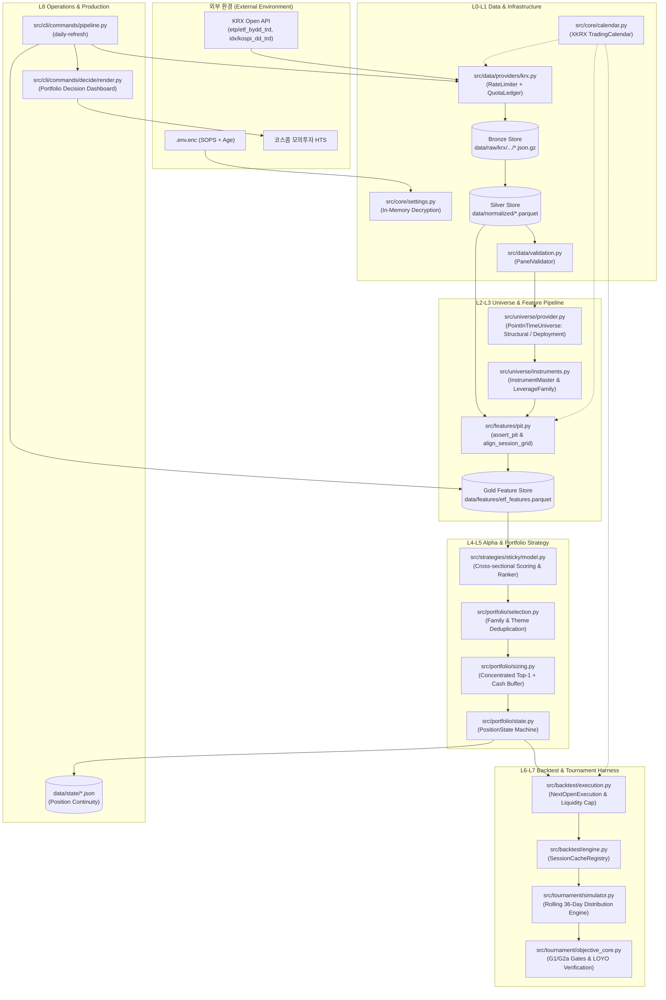

# Architecture Overview

머니투데이 제3회 ETF 투자왕 대회(2026-09-21 ~ 2026-11-13, 36 거래세션) 대응을 위한 **Tournament Quant Research & Execution System**의 시스템 개요 및 고수준 아키텍처 문서입니다.

---

## 1. System Goal & Objective Function

본 시스템은 장기 자산 배분이나 샤프 지수(Sharpe Ratio) 극대화를 목표로 하는 일반 퀀트 시스템이 아닙니다.  
**약 36거래일의 단기 모의투자 대회 환경에서 1위(대상) 또는 2위(최우수상) 순위에 진입할 확률을 극대화**하는 것을 단일 경제적 목표로 삼습니다.

```text
Primary Economic Objective: Maximize P(rank in {1, 2}) over 36 trading sessions
```

### 대회 상금 구조와 효용 함수의 비대칭성
대회 상금 구조는 순위에 대한 계단 함수(Step Function)입니다.

$$\\mathbb{E}[\\text{Prize}] = 10{,}000{,}000 \\cdot P(\\text{rank}=1) + 5{,}000{,}000 \\cdot P(\\text{rank}=2) + 1{,}000{,}000 \\cdot P(\\text{category top}=1)$$

* 3위와 400위의 상금 보상은 **0원으로 동일**합니다.
* 따라서 표준편차를 최소화하고 샤프를 높이는 전통적 분산 포트폴리오는 연율 5~10% 수준의 온건한 수익에 머물러 대회 우승 가능성이 0에 수렴합니다.
* 시스템은 우측 꼬리 확률 $P(R_{36d} > \\theta)$ ($\\theta \\in \\{30\\%, 40\\%, 50\\%, 60\\%\\}$)를 전략 채택의 주요 대리 목적함수(Adoption Proxy)로 사용합니다.
* 단, 36세션 중 극단적 손실(-25% 이하)을 입으면 대회 잔여기간 내 회복이 불가능하므로, 엄격한 파산 제약(Ruin Constraint, G2a: $P(R_{36d} < -25\\%) \\le 5\\%$)을 하드 게이트로 병행 적용합니다.

---

## 2. System Boundary

| 구분 | 포함 범위 (In-Scope) | 배제 범위 (Out-of-Scope) |
| :--- | :--- | :--- |
| **자산군** | KRX 상장 국내 ETF (지수, 섹터, 레버리지) | 개별 주식, 선물·옵션 직접 매매, 해외 직투 |
| **운용사 필터** | 대회 후원 10개 운용사 발행 ETF (`configs/sponsor_brands.yaml`) | 비후원사 ETF (배포 모드 한정) |
| **타임프레임** | 일별 봉(Daily Bar) 기반 시계열 분석 및 일별 리밸런싱 | 틱(Tick)·분(Minute) 단위 인트라데이 초단타 |
| **체결 모델** | $t$일 장 마감(15:30) 후 시그널 산출 $\\to$ $t+1$일 시가(09:00 Open) 체결 | 당일 종가 동시체결 (Same-bar Fill) |
| **실행 방식** | 포트폴리오 목표 수량/금액 자동 산출 $\\to$ 코스콤 HTS 수동 주문 | 전산 자동 주문(DMA/API 주문 연동) |
| **머신러닝** | 얕은 트리 기반 GBDT Ranker (엄격한 용량 제약) | 심층 신경망(Deep Learning), 강화학습(RL) |

---

## 3. High-Level Architecture

시스템은 **Signal(Alpha) $\\neq$ Portfolio(Allocation) $\\neq$ Tournament Policy(Overlay)** 원칙에 따라 관심사를 엄격히 분리합니다.



---

## 4. Core Components Summary

| Layer | 디렉터리 / 모듈 | 핵심 책임 (Responsibility) |
| :--- | :--- | :--- |
| **L0 Core** | [`src/core/`](../../src/core) | SOPS 인메모리 복호화, XKRX 세션 달력, 불변 경로(`DataPaths`), 태그 로깅 |
| **L1 Data** | [`src/data/`](../../src/data) | KRX Open API 연동(토큰버킷 레이트리밋, 일일 쿼터), 불변 Bronze(`.json.gz`), 타입 정규화 Silver Parquet |
| **L2 Universe** | [`src/universe/`](../../src/universe) | Point-in-Time 유니버스 판정, 종목 마스터(`InstrumentMaster`), 동일 지수 레버리지 패밀리 그룹화 |
| **L3 Features** | [`src/features/`](../../src/features) | 모멘텀·변동성·자금흐름·시장브레드스·시장국면(Regime) 벡터 연산, 엄격한 `assert_pit` 가드 |
| **L4 Alpha** | [`src/strategies/`](../../src/strategies), [`src/alpha/`](../../src/alpha) | 단면 상대강도 랭킹, 챔피언 전략(`sticky.mom60_post_crash_anchor`), 머신러닝 GBDT Ranker |
| **L5 Portfolio** | [`src/portfolio/`](../../src/portfolio) | 동일 패밀리 중복 제거, Top-1 집중 비중 산출(최대 95%), 유동성(ADV 5%) 제약, 상태 전이 머신 |
| **L6 Backtest** | [`src/backtest/`](../../src/backtest) | $t$일 종가 시그널 $\\to$ $t+1$일 시가 체결(`NextOpenExecution`), 슬리피지·수수료 그리드, 그리드 캐싱 |
| **L7 Tournament** | [`src/tournament/`](../../src/tournament) | 36거래일 롤링 윈도우(2,000+개) 전수 시뮬레이션, G1/G2a 게이트 판정, 연도별 LOYO 검증 |
| **L8 Ops & CLI** | [`src/cli/`](../../src/cli), [`deploy/`](../../deploy) | 15개 서브커맨드 CLI(`mt-etf`), 마감 후 16:00 배치(`daily-refresh`), systemd 타이머 서비스 |

---

## 5. End-to-End Runtime Flow

시스템의 정기 운영(Daily Batch) 및 전략 리서치 실행 흐름은 다음 7단계를 따릅니다.

1. **Bronze 수집 (`cmd_ingest`)**:
   * KRX OpenAPI에서 당일 ETF 일별 매매실적 및 KOSPI 일별 시세를 JSON envelope으로 수집하여 `data/raw/krx/.../{YYYYMMDD}.json.gz`에 저장합니다.
   * 토큰 버킷 기반 rate limiter(초당 2~5회)와 `krx_quota.json`을 통해 일일 호출 쿼터 소진 시 즉시 작업을 일시 중단합니다.

2. **Silver 정규화 (`cmd_normalize`)**:
   * 휴장일 응답(1,163행 공백 가격), 빈 응답 등 이상 데이터를 fail-closed로 필터링하고, `DatasetSchema`를 통해 엄격한 타입 캐스팅을 수행합니다.
   * `data/normalized/etf_daily.parquet` 및 `index_daily.parquet`로 증분(incremental) 병합합니다.

3. **PIT Universe 필터링 (`PointInTimeUniverse`)**:
   * $t$ 시점에 실제 상장되어 거래된 종목(`first_seen` $\\le t \\le$ `last_seen`), 유효 종가 존재, 60세션 이상의 히스토리, 후원 운용사 브랜드 일치 여부, 20일 평균 거래대금(ADV $\\ge$ 1억 원)을 순차 필터링합니다.

4. **Gold Feature 연산 (`cmd_features`)**:
   * `assert_pit(frame, decision_date)`를 강제 통과한 후 모멘텀(3, 5, 10, 20, 40, 60일), 변동성, 자금유입률, 마켓 브레드스, 5단계 시장 국면(STRONG_RISK_OFF ~ STRONG_RISK_ON)을 Polars로 고속 벡터 연산하여 `etf_features.parquet`를 빌드합니다.

5. **Alpha 시그널 및 포트폴리오 산출 (`cmd_decide`)**:
   * 챔피언 전략(`sticky.mom60_post_crash_anchor`)이 지수 모멘텀 및 급락 후 반등 앵커 룰을 평가하여 최선호 종목을 선정합니다.
   * `ClusterAwareSelection`이 동일 지수 레버리지 패밀리(1X, 2X, -1X, -2X) 중복을 1개로 압축하고, ADV 5% 참여율 한도 및 최대 단일 비중 95% 제약을 적용합니다.

6. **체결 상태 승계 및 영속화 (`PositionState`)**:
   * `data/state/{model}_position.json`에 보관된 이전 보유 종목과 연속성을 대조합니다.
   * 연속성이 훼손되었을 경우 안전을 위해 작업을 중단(fail-closed)하며, 최소 보유 세션(2일) 및 갭 임계값을 적용하여 불필요한 매매 회전율(Turnover)을 방지합니다.

7. **HTS 주문 가이드 생성 및 배치 완료**:
   * 결정일 종가 기준 권장 매매 수량(주) 및 주문 금액을 터미널에 렌더링하고 `results/decide_daily/{date}.json`에 아티팩트로 저장합니다.

---

## 6. External Dependencies

* **런타임 라이브러리**:
  * `exchange-calendars`: 한국거래소(XKRX) 공휴일 및 개장일 캘린더 기준 소스
  * `polars` / `pyarrow`: 대규모 일별 패널의 고속 벡터화 처리 및 Parquet 입출력
  * `pydantic` / `pydantic-settings`: 환경설정 스키마 검증 및 정적 타입 강제
  * `tenacity` / `httpx`: KRX API 호출 시 지수 백오프 및 연결 타임아웃 제어
  * `lightgbm`: 단면 랭킹 머신러닝 Alpha 모델 학습 및 추론
* **환경설정**:
  * `.env` (git 비추적, `pydantic-settings` dotenv 소스): 비밀값을 평문 파일로 로컬/서버에 직접 배치
* **외부 통신**:
  * 한국거래소 오픈 API (`https://data-dbg.krx.co.kr/svc/apis`)
