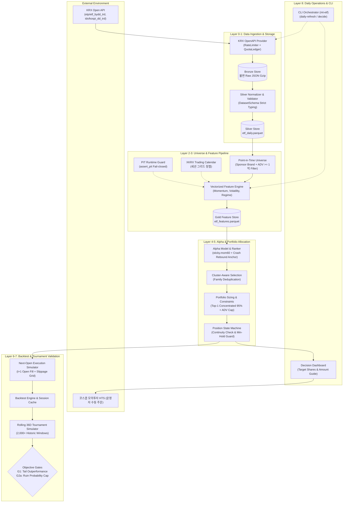
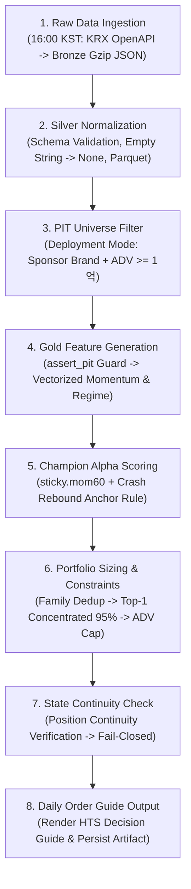

# Architecture Overview

머니투데이 제3회 ETF 투자왕 대회(2026-09-21 ~ 2026-11-13, 36 거래세션) 대응을 위한 **Tournament Quant Research & Execution System**의 시스템 개요 및 고수준 아키텍처 문서입니다.

---

## 1. System Goal & Objective Function

본 시스템은 일반적인 펀드 운용(Sharpe 지수 극대화, 변동성 최소화)과 근본적으로 다른 경제적 목적을 가집니다.  
**약 36거래일의 단기 모의투자 대회 환경에서 1위(대상) 또는 2위(최우수상) 순위에 진입할 확률을 극대화**하는 것을 단일 경제적 목표로 삼습니다.

```text
Primary Economic Objective: Maximize P(rank in {1, 2}) over 36 trading sessions
```

### 대회 상금 구조와 효용 함수의 비대칭성
대회 상금 구조는 순위에 대한 계단 함수(Step Function)입니다.

$$\mathbb{E}[\text{Prize}] = 10{,}000{,}000 \cdot P(\text{rank}=1) + 5{,}000{,}000 \cdot P(\text{rank}=2) + 1{,}000{,}000 \cdot P(\text{category top}=1)$$

* 3위와 400위의 상금 보상은 **0원으로 동일**합니다.
* 따라서 포트폴리오 변동성을 낮추고 샤프 지수를 높이는 전통적 분산 포트폴리오는 연율 5~10% 수준의 온건한 수익에 머물러 대회 우승 가능성이 0에 수렴합니다.
* 시스템은 우측 꼬리 확률 $P(R_{36d} > \theta)$ ($\theta \in \{30\%, 40\%, 50\%, 60\%\}$)를 전략 채택의 주요 대리 목적함수(Adoption Proxy)로 사용합니다.
* 단, 36세션 중 극단적 손실(-25% 이하)을 입으면 잔여 기간 내 회복이 불가능하므로, 엄격한 **파산 제약(Ruin Constraint, G2a: $P(R_{36d} < -25\%) \le 5\%$)**을 하드 게이트로 병행 적용합니다.

---

## 2. System Boundary

| 구분 | 포함 범위 (In-Scope) | 배제 범위 (Out-of-Scope) |
| :--- | :--- | :--- |
| **자산군** | KRX 상장 국내 ETF (지수, 섹터, 레버리지) | 개별 주식, 선물·옵션 직접 매매, 해외 직투 |
| **운용사 필터** | 대회 후원 10개 운용사 발행 ETF | 비후원사 ETF (배포 모드 한정) |
| **타임프레임** | 일별 봉(Daily Bar) 기반 시계열 분석 및 일별 리밸런싱 | 틱(Tick)·분(Minute) 단위 인트라데이 초단타 |
| **체결 모델** | $t$일 장 마감(15:30) 후 시그널 산출 $\to$ $t+1$일 시가(09:00 Open) 체결 | 당일 종가 동시체결 (Same-bar Fill) |
| **실행 방식** | 포트폴리오 목표 수량/금액 자동 산출 $\to$ 코스콤 HTS 수동 주문 | 전산 자동 주문(DMA/API 주문 연동) |
| **머신러닝** | 얕은 트리 기반 GBDT Ranker (엄격한 용량 제약) | 심층 신경망(Deep Learning), 강화학습(RL) |

---

## 3. High-Level Architecture

시스템은 **Signal(Alpha) $\neq$ Portfolio(Allocation) $\neq$ Tournament Policy(Overlay)** 원칙에 따라 관심사를 계층별로 엄격히 분리합니다.



---

## 4. Layered Architecture Breakdown

시스템을 구성하는 9개 계층의 핵심 책임과 설계 불변식입니다.

| Layer | 계층명 | 주요 역할 및 책임 | 핵심 설계 원칙 및 불변식 |
| :--- | :--- | :--- | :--- |
| **L0** | **Infrastructure** | 시스템 설정 로드, XKRX 거래소 캘린더 동기화, 불변 디렉터리 경로 관리 | 파일 경로 하드코딩 금지, 거래일 캘린더 단일 진실천(Single Source of Truth) |
| **L1** | **Ingestion** | KRX Open API 일일 시세 수집, 토큰 버킷 속도 제어, 불변 Bronze 영속화 | API 쿼터 초과 방지, 원본 데이터 가공 없는 Write-Once 압축 보관 |
| **L2** | **Normalization** | 결측치 및 타입 정규화, Silver Parquet 증분 병합 | 결측 공백(`""`)을 0이 아닌 `None` 디코딩, 휴장일 더미 레코드 자동 격리 |
| **L3** | **PIT Features** | 상장/생존 필터링, 모멘텀/변동성/시장국면 고속 벡터 연산 | `assert_pit` 런타임 가드(미래 데이터 참조 시 즉시 중단), 팬텀 세션 NaN 전파 방어 |
| **L4** | **Alpha Scoring** | 60일 모멘텀 랭킹 및 급락 후 반등 앵커 룰 평가 | 단면 상대강도 랭킹 산출, 시장 국면별 동적 슬리브 라우팅 |
| **L5** | **Portfolio Policy** | 동일 기초지수 레버리지 패밀리 중복 제거, Top-1 집중 비중 산출 | 팩터 중복 베팅 차단, ADV 5% 참여율 상한, 최소 2세션 보유 가드 |
| **L6** | **Execution Engine** | 익일 개장 시가($t+1$ Open) 체결 시뮬레이션 및 슬리피지/수수료 반영 | Same-bar Fill 가정 배제, 거래정지 및 시가 결측 종목 체결 불가 판정 |
| **L7** | **Tournament Harness** | 2,000+개 롤링 36D 윈도우 시뮬레이션, G1/G2a 하드 게이트 판정 | 연도별 Out-of-Sample(LOYO) 검증, 파산 위험($P(R<-25\%) \le 5\%$) 강제 |
| **L8** | **Daily Operations** | 장 마감 후 원스톱 자동 배치 및 터미널 HTS 주문 가이드 렌더링 | 프로세스 재시작 간 포지션 연속성 검증, 일일 의사결정 JSON 아티팩트 보관 |

---

## 5. End-to-End Runtime Flow

매일 15:30 정규 장 마감 후 16:00 KST에 수행되는 일일 배치 파이프라인의 엔드투엔드 처리 흐름입니다.



1. **Bronze 수집**: KRX OpenAPI에서 당일 ETF 매매실적 및 KOSPI 시세를 수집하여 불변 압축 파일로 영속화합니다. 일일 호출 쿼터 소진 시 작업을 즉시 일시 중단합니다.
2. **Silver 정규화**: 휴장일 더미 레코드를 제외하고, 스키마 검증을 거쳐 고성능 Parquet 포맷으로 일별 증분 병합합니다.
3. **PIT Universe 필터링**: 당일 실제 상장 거래 종목 중 후원 10개 운용사 브랜드 및 유동성(ADV $\ge$ 1억 원) 조건을 만족하는 적격 종목군을 확정합니다.
4. **Gold Feature 연산**: `assert_pit` 가드로 시계열 정합성을 확인한 후, 모멘텀·변동성·시장국면 피처를 Polars 벡터 연산으로 고속 생성합니다.
5. **Alpha 시그널 산출**: 챔피언 전략이 시장 국면(LOTTERY_ON vs CRASH_REBOUND)에 맞춰 최우선 순위 종목을 선정합니다.
6. **포트폴리오 비중 배분**: 동일 지수 레버리지 패밀리 중복을 단일 종목으로 압축하고, Top-1 집중(95%) 및 ADV 5% 참여율 한도를 적용합니다.
7. **체결 상태 승계 및 영속화**: 이전 보유 포지션과의 연속성을 대조하고 최소 보유 세션(2일)을 적용하여 불필요한 매매 회전율을 차단합니다.
8. **HTS 주문 가이드 생성**: 당일 종가 기준 권장 매매 수량(주) 및 주문 금액을 터미널 대시보드에 렌더링하고 아티팩트로 저장하여 익일 09:00 장 시작 전 운영자의 정확한 주문 입력을 지원합니다.

---

## 6. External Dependencies & Technology Stack

* **시계열 & 캘린더 엔진**: `exchange-calendars` (XKRX 거래일 단일 기준점)
* **초고속 컬럼너 컴퓨팅**: `polars`, `pyarrow` (Zero-copy In-Memory 벡터 연산 및 Parquet 입출력)
* **환경설정 & 타입 검증**: `pydantic`, `pydantic-settings` (엄격한 스키마 검증 및 정적 타이핑)
* **통신 & 복원력 제어**: `httpx`, `tenacity` (KRX API 토큰 버킷 레이트 리미터 및 지수 백오프)
* **머신러닝 벤치마크**: `lightgbm` (단면 랭킹 GBDT LambdaRank)
* **외부 통신 엔드포인트**: 한국거래소 오픈 API (`https://data-dbg.krx.co.kr/svc/apis`)
