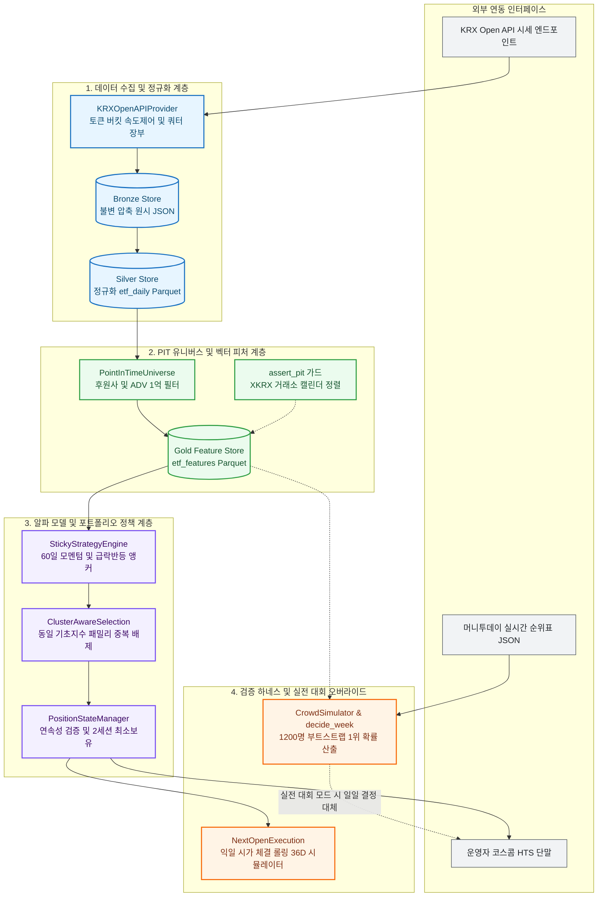
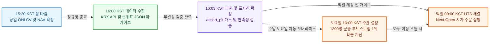

# System Architecture & Design Specification

> **머니투데이 제3회 ETF 투자왕 대회(2026) 토너먼트 퀀트 시스템 핵심 아키텍처 정본 명세서**

---

## 1. System Goals & Boundaries

본 시스템은 일반 펀드의 복리 자산배분(Sharpe 극대화, 저변동성)과 달리, 단기(36거래일) 계단형 상금 구조에서 **대회 1~2위 진입 확률 극대화**를 단일 경제적 목표로 삼습니다.

```text
Primary Economic Objective: Maximize P(rank in {1, 2}) over 36 trading sessions
```

| 구분 | 포함 범위 (In-Scope) | 배제 범위 (Out-of-Scope) |
| :--- | :--- | :--- |
| **대상 자산군** | KRX 상장 국내 ETF (지수, 섹터, 레버리지/인버스) | 개별 주식, 장외 파생, 선물·옵션 직접 매매 |
| **운용사 필터** | 대회 후원 10개사 발행 ETF (`deployment` 실전 모드) | 비후원사 ETF (실거래 주문 불가 종목) |
| **타임프레임** | 일별 봉(Daily Bar) 기반 시계열 피처 및 일별 리밸런싱 | 틱(Tick) 및 분(Minute) 단위 인트라데이 초단타 |
| **체결 모델** | $t$일 장 마감 후 시그널 확정 $\to$ $t+1$일 개장 시가(09:00) 체결 | 당일 종가 동시체결 (Same-bar Fill, 미래 참조 편향) |
| **주문 집행** | 최적 포트폴리오 목표 수량/금액 산출 $\to$ 코스콤 HTS 수동 주문 | DMA 전산 자동 주문 연동 (대회 규정상 API 주문 미지원) |
| **실전 오버라이드** | 실시간 순위표 군중(~1,200명) 재현 기반 주간 $P(\text{rank}=1)$ 결정 | 주중 잦은 노이즈 손절 (시뮬레이션상 1위 확률 저하 유발) |
| **머신러닝** | 용량 제약형 얕은 GBDT Ranker (`max_depth=4`, `num_leaves=8`) | 딥러닝(Transformer/LSTM), 강화학습 등 고용량 과적합 모델 |

---

## 2. Component Topology & External Interfaces

시스템은 **Ingestion $\to$ Feature $\to$ Alpha $\to$ Portfolio $\to$ Backtest $\to$ Live Contest**의 계층 관심사를 엄격히 분리합니다.



| 서브시스템 | 핵심 컴포넌트 | 책임 및 인터페이스 | 강제 불변식 (Fail-Closed) |
| :--- | :--- | :--- | :--- |
| **Ingestion** | `KRXOpenAPIProvider`, `BronzeStore` | KRX 시세 수집 및 불변 `.json.gz` 영속화 | Token Bucket(초당 2~5회), Quota 초과 시 호출 즉시 중단 |
| **Normalization** | `SilverBuilder`, `DatasetSchema` | 스키마 검증, 공백 디코딩, Parquet 증분 병합 | 결측 공백(`""`)을 `None` 변환(0.0 왜곡 방지), 휴장일 더미 격리 |
| **PIT Features** | `PointInTimeUniverse`, `FeatureBuilder` | 듀얼 유니버스 판정, 모멘텀/변동성/레짐 벡터 연산 | `assert_pit` 런타임 가드, 임시 휴장 팬텀 세션 격리 |
| **Alpha & Policy** | `StickyStrategyEngine`, `PortfolioSizing` | 챔피언 룰 스코어링, 레버리지 중복 제거, 비중 산출 | 기초지수 패밀리 중복 금지, Top-1 95% 집중 + ADV 5% 참여율 캡 |
| **Execution** | `NextOpenExecution`, `PositionStateManager` | 익일 09:00 시가 체결 시뮬레이션, 포지션 원장 관리 | Same-bar Fill 원천 배제, 프로세스 재시작 간 해시 연속성 검증 |
| **Contest Live** | `LeaderboardArchive`, `CrowdSimulator` | 순위표 불변 아카이브, 군중 부트스트랩, $P(\text{rank}=1)$ 산출 | 순위표 기준일 불일치 시 `NO_DATA` 유지, 5%p 미만 전환 금지 |

---

## 3. 24/7 State Machine & Orchestration Lifecycle

일일 운용 및 주간 대회 의사결정은 엄격한 시간축 전이 규칙을 따릅니다.



### 포지션 상태 머신 전이 불변식
1. **FLAT $\to$ ENTER**: 유동성 필터(20일 ADV $\ge$ 1억 원) 및 동일 기초지수 패밀리 최상위 1개 종목에 95% 집중 배분 (5% 현금 버퍼).
2. **ENTER $\to$ HOLD**: 최소 보유 기간(2거래일) 동안 임의 청산 불가(불필요한 매매 회전율 및 슬리피지 방지).
3. **HOLD $\to$ EXIT**: 60일 모멘텀 음전, 급락 반등 앵커 15% 손절 가드 발동, 또는 주간 $P(\text{rank}=1)$ 우월 종목 발견 시 $t+1$ 시가 전량 청산.
4. **Fail-Closed 장애 방어**: 전일 저장 포지션 해시 불일치, 데이터 결측, 순위표 불일치 발생 시 즉시 주문 생성을 차단하고 현 포지션을 동결 유지.

---

## 4. Data Models & Financial Integrity Barriers

```text
data/
├── raw/krx/                      # [Bronze] 불변 Write-Once 압축 원시 JSON (.json.gz)
├── normalized/                   # [Silver] 정규화 시계열 패널 (etf_daily.parquet, index_daily.parquet)
├── features/                     # [Gold] 단면 랭킹 및 시장 국면 벡터 패널 (etf_features.parquet)
├── state/                        # [Ledger] 포지션 영속화 및 런타임 연속성 상태 (JSON)
└── contest/leaderboard/          # [Contest] 머니투데이 순위표 5종 불변 스냅샷 (<baseDt>/*.json)
```

### 5대 도메인 금융 무결성 배리어
1. **시계열 누출 원천 차단 (`assert_pit`)**: 피처 연산 프레임 내 $date > decision\_date$ 데이터 유입 시 즉시 `PitViolationError` 예외 중단.
2. **결측치 왜곡 방어 (`DatasetSchema`)**: KRX API 공백 문자열(`""`)을 `0.0`이 아닌 `None`으로 강제 디코딩하여 가짜 -100% 수익률 방지. 유효 가격 비율 미달 시 휴장일 더미 레코드(1,163행) 자동 격리.
3. **XKRX 캘린더 세션 정렬 (`align_session_grid`)**: 단순 날짜 나열이 아닌 거래소 공식 개장 세션을 기준으로 그리드를 정렬하고, 임시 휴장 세션을 분리하여 `rolling_*` 연산의 NaN 전파 원천 차단.
4. **미수정 실체결가 원칙 (Unadjusted Price)**: 레버리지/인버스 ETF의 변동성 감쇠(Volatility Drag)를 그대로 반영하기 위해 임의 합성 가격을 배제하고 KRX 실제 체결 가격만 사용.
5. **동일 기초지수 패밀리 중복 배제 (Family Deduplication)**: 동일 기초자산을 추종하는 다중 배수 종목군(1X, 2X, -1X, -2X)을 단일 그룹으로 묶어 상위 1개만 허용함으로써 단일 팩터 과다 노출 차단.

---

## 5. Strict Layer Contracts & Static Verification Rules

시스템은 하위 계층이 상위 계층을 참조할 수 없는 단방향 의존성 규칙을 강제합니다.

```text
Layer 8: CLI 진입점 & 운영 대시보드 (`src/cli/`)
   ↓
Layer 6-7: 백테스트 시뮬레이터 & 토너먼트 하네스 (`src/backtest/`, `src/tournament/`)
   ↓
Layer 4-5: 알파 모델, 포트폴리오 비중 & 레버리지 패밀리 정책 (`src/alpha/`, `src/portfolio/`)
   ↓
Layer 2-3: PIT 유니버스 & 벡터 피처 엔진 (`src/universe/`, `src/features/`)
   ↓
Layer 0-1: 인프라 기반, 거래소 캘린더 & 데이터 정규화 스토리지 (`src/core/`, `src/data/`)
────────────────────────────────────────────────────────────────────────
[Live Contest Override] Layer 9: 순위표 아카이브 & 군중 시뮬레이션 (`src/contest/`)
```

### Python AST 기반 기계적 아키텍처 불변식 규칙
* **ARCH-1 / INV-24 (레이어 경계 보존)**: `tests/unit/architecture/test_layer_boundaries.py`에서 AST 파싱을 통해 `src/alpha`, `src/portfolio`, `src/strategies/factories`가 상위 계층(`src.tournament`, `src.cli`)을 역참조하는 것을 원천 차단.
* **모듈 라인/구문 버짓 제약**: `tests/unit/architecture/test_module_line_budget.py`에서 단일 파일당 실행 구문 400개(`STATEMENT_BUDGET = 400`), 단일 줄 길이 200자 이하, 한 줄 다중 구문 금지 강제.
* **타입 안전성**: `pyproject.toml`에 선언된 `mypy --strict`로 소스 코드 전체 타입 오류 0건 유지.
